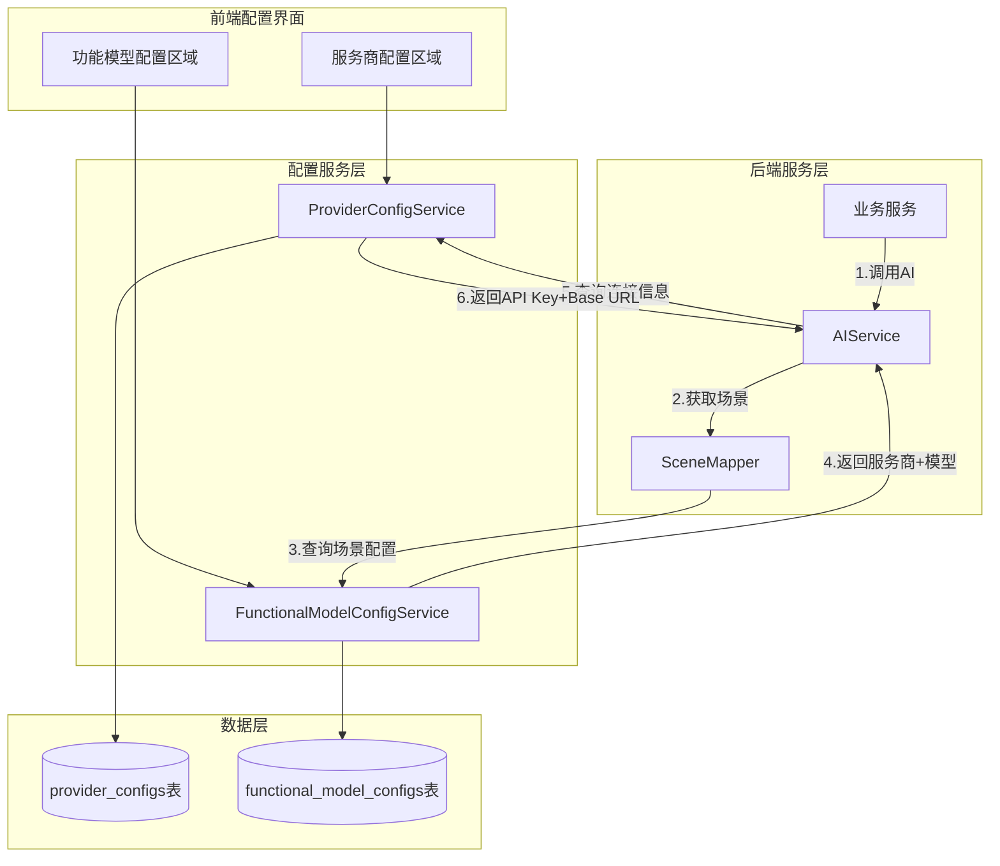

# AI服务商与功能模型配置分离设计文档

## Overview

本设计将AI配置分为两个独立的层次：
1. **服务商配置层** - 管理API连接信息（API Key、Base URL）
2. **功能模型配置层** - 管理场景到服务商+模型的映射

这种分离使得：
- 服务商配置只关注"如何连接"
- 功能模型配置只关注"使用什么"
- 后端服务只需要知道"场景"，系统自动完成配置查询

## Architecture



## Components and Interfaces

### 1. 数据实体

#### ProviderConfig（服务商配置实体）
```java
@Entity
@Table(name = "provider_configs")
public class ProviderConfig {
    @Id
    @GeneratedValue(strategy = GenerationType.UUID)
    private UUID id;
    
    @ManyToOne(fetch = FetchType.LAZY)
    @JoinColumn(name = "user_id", nullable = false)
    private User user;
    
    @Column(nullable = false, length = 50)
    @Enumerated(EnumType.STRING)
    private ProviderType providerType; // GEMINI, DEEPSEEK, OPENAI, CUSTOM
    
    @Column(name = "encrypted_key", columnDefinition = "TEXT")
    private String encryptedKey;
    
    @Column(name = "key_hint", length = 20)
    private String keyHint;
    
    @Column(name = "base_url", columnDefinition = "TEXT")
    private String baseUrl;
    
    @Column(name = "is_configured")
    private Boolean isConfigured = false;
    
    @CreationTimestamp
    private Instant createdAt;
    
    @UpdateTimestamp
    private Instant updatedAt;
}
```

#### FunctionalModelConfig（功能模型配置实体）
```java
@Entity
@Table(name = "functional_model_configs")
public class FunctionalModelConfig {
    @Id
    @GeneratedValue(strategy = GenerationType.UUID)
    private UUID id;
    
    @ManyToOne(fetch = FetchType.LAZY)
    @JoinColumn(name = "user_id", nullable = false)
    private User user;
    
    @Column(nullable = false, length = 50)
    @Enumerated(EnumType.STRING)
    private SceneType scene; // CREATIVE, STRUCTURE, WRITING, ANALYSIS, VIDEO, SPEECH
    
    @Column(nullable = false, length = 50)
    @Enumerated(EnumType.STRING)
    private ProviderType providerType;
    
    @Column(nullable = false, length = 100)
    private String model;
    
    @CreationTimestamp
    private Instant createdAt;
    
    @UpdateTimestamp
    private Instant updatedAt;
}
```

### 2. 枚举类型

#### ProviderType（服务商类型）
```java
public enum ProviderType {
    GEMINI("gemini", "Google Gemini"),
    DEEPSEEK("deepseek", "DeepSeek"),
    OPENAI("openai", "OpenAI"),
    CUSTOM("custom", "自定义");
    
    private final String value;
    private final String displayName;
}
```

#### SceneType（场景类型）- 已存在，保持不变
```java
public enum SceneType {
    CREATIVE("creative"),    // 创意生成
    STRUCTURE("structure"),  // 结构化生成
    WRITING("writing"),      // 长文写作
    ANALYSIS("analysis"),    // 分析任务
    VIDEO("video"),          // 视频生成
    SPEECH("speech");        // 语音生成
}
```

### 3. 服务接口

#### ProviderConfigService
```java
public interface ProviderConfigService {
    // 保存服务商配置（只有API Key和Base URL）
    ProviderConfig saveConfig(UUID userId, SaveProviderConfigRequest request);
    
    // 获取用户所有服务商配置
    List<ProviderConfigDto> getAllConfigs(UUID userId);
    
    // 获取已配置的服务商列表（用于功能模型配置的下拉框）
    List<ProviderType> getConfiguredProviders(UUID userId);
    
    // 获取指定服务商的连接信息
    ProviderConnectionInfo getConnectionInfo(UUID userId, ProviderType providerType);
    
    // 删除服务商配置（需检查引用）
    void deleteConfig(UUID userId, ProviderType providerType);
    
    // 验证服务商配置有效性
    boolean validateConfig(UUID userId, ProviderType providerType);
}
```

#### FunctionalModelConfigService
```java
public interface FunctionalModelConfigService {
    // 保存场景配置
    FunctionalModelConfig saveConfig(UUID userId, SaveFunctionalModelConfigRequest request);
    
    // 获取用户所有场景配置
    List<FunctionalModelConfigDto> getAllConfigs(UUID userId);
    
    // 获取指定场景的配置
    FunctionalModelConfigDto getConfigByScene(UUID userId, SceneType scene);
    
    // 批量更新场景配置
    void batchUpdateConfigs(UUID userId, List<SaveFunctionalModelConfigRequest> requests);
    
    // 获取指定服务商支持的模型列表
    List<String> getSupportedModels(ProviderType providerType);
}
```

#### AIConfigResolver（AI配置解析器）
```java
public interface AIConfigResolver {
    // 根据场景获取完整的AI配置（服务商+模型+连接信息）
    ResolvedAIConfig resolveConfig(UUID userId, SceneType scene);
    
    // 根据业务服务类型获取场景
    SceneType getSceneForService(String serviceType);
}
```

### 4. DTO定义

```java
// 保存服务商配置请求
public record SaveProviderConfigRequest(
    ProviderType providerType,
    String apiKey,
    String baseUrl
) {}

// 保存功能模型配置请求
public record SaveFunctionalModelConfigRequest(
    SceneType scene,
    ProviderType providerType,
    String model
) {}

// 服务商配置DTO
public record ProviderConfigDto(
    ProviderType providerType,
    String displayName,
    String keyHint,
    String baseUrl,
    boolean isConfigured
) {}

// 功能模型配置DTO
public record FunctionalModelConfigDto(
    SceneType scene,
    String sceneDisplayName,
    ProviderType providerType,
    String model
) {}

// 解析后的AI配置
public record ResolvedAIConfig(
    ProviderType providerType,
    String model,
    String apiKey,
    String baseUrl
) {}
```

## Data Models

### 数据库表结构

#### provider_configs 表
```sql
CREATE TABLE provider_configs (
    id UUID PRIMARY KEY DEFAULT gen_random_uuid(),
    user_id UUID NOT NULL REFERENCES users(id),
    provider_type VARCHAR(50) NOT NULL,
    encrypted_key TEXT,
    key_hint VARCHAR(20),
    base_url TEXT,
    is_configured BOOLEAN DEFAULT FALSE,
    created_at TIMESTAMP WITH TIME ZONE DEFAULT NOW(),
    updated_at TIMESTAMP WITH TIME ZONE DEFAULT NOW(),
    UNIQUE(user_id, provider_type)
);
```

#### functional_model_configs 表
```sql
CREATE TABLE functional_model_configs (
    id UUID PRIMARY KEY DEFAULT gen_random_uuid(),
    user_id UUID NOT NULL REFERENCES users(id),
    scene VARCHAR(50) NOT NULL,
    provider_type VARCHAR(50) NOT NULL,
    model VARCHAR(100) NOT NULL,
    created_at TIMESTAMP WITH TIME ZONE DEFAULT NOW(),
    updated_at TIMESTAMP WITH TIME ZONE DEFAULT NOW(),
    UNIQUE(user_id, scene),
    FOREIGN KEY (user_id, provider_type) 
        REFERENCES provider_configs(user_id, provider_type)
);
```

### 业务服务到场景映射配置
```java
public class ServiceSceneMapping {
    private static final Map<String, SceneType> MAPPING = Map.ofEntries(
        // 创意生成场景
        entry("GeneralChatHandler", SceneType.CREATIVE),
        entry("ProjectIdeaService", SceneType.CREATIVE),
        entry("CharacterNameService", SceneType.CREATIVE),
        
        // 结构化生成场景
        entry("InitializationHandler", SceneType.STRUCTURE),
        entry("PlottingHandler", SceneType.STRUCTURE),
        entry("WorldBuildingService", SceneType.STRUCTURE),
        entry("CharacterService", SceneType.STRUCTURE),
        entry("OutlineService", SceneType.STRUCTURE),
        
        // 长文写作场景
        entry("DraftingHandler", SceneType.WRITING),
        entry("WritingStudioService", SceneType.WRITING),
        entry("PolishService", SceneType.WRITING),
        
        // 分析任务场景
        entry("PreflightService", SceneType.ANALYSIS),
        entry("EvolutionService", SceneType.ANALYSIS),
        entry("IntentRecognitionService", SceneType.ANALYSIS),
        entry("QueryExpansionService", SceneType.ANALYSIS),
        entry("WikiExtractService", SceneType.ANALYSIS)
    );
}
```


## Correctness Properties

*A property is a characteristic or behavior that should hold true across all valid executions of a system-essentially, a formal statement about what the system should do. Properties serve as the bridge between human-readable specifications and machine-verifiable correctness guarantees.*

### Property 1: 服务商配置不包含模型信息
*For any* 服务商配置保存请求，保存后的配置应只包含 providerType、apiKey、baseUrl，不包含任何模型选择信息
**Validates: Requirements 1.1**

### Property 2: 服务商配置验证
*For any* API Key 和 Base URL 组合，验证函数应正确判断其有效性（非空、格式正确）
**Validates: Requirements 1.2**

### Property 3: 服务商配置状态一致性
*For any* 服务商配置，当 API Key 非空时 isConfigured 应为 true，否则为 false
**Validates: Requirements 1.3**

### Property 4: 服务商类型枚举完整性
*For any* 服务商类型字符串，如果是预定义类型（gemini、deepseek、openai、custom）则应被接受，否则应被拒绝
**Validates: Requirements 1.4**

### Property 5: 已配置服务商过滤
*For any* 用户的功能模型配置界面，服务商下拉框返回的列表应只包含该用户已配置 API Key 的服务商
**Validates: Requirements 2.1, 4.4**

### Property 6: 功能模型配置三元组完整性
*For any* 功能模型配置保存请求，保存后应能通过场景查询到完整的（场景、服务商、模型）三元组
**Validates: Requirements 2.3**

### Property 7: 场景配置独立性
*For any* 两个不同的场景，修改其中一个的配置不应影响另一个的配置
**Validates: Requirements 2.4**

### Property 8: 场景到配置的查询正确性
*For any* 已配置的场景，通过场景查询应返回正确的服务商和模型
**Validates: Requirements 3.2**

### Property 9: 服务商到连接信息的查询正确性
*For any* 已配置的服务商，通过服务商类型查询应返回正确的 API Key 和 Base URL
**Validates: Requirements 3.3**

### Property 10: 未配置场景错误处理
*For any* 未配置的场景，查询时应返回明确的错误信息而非空值或默认值
**Validates: Requirements 3.4**

### Property 11: 未配置服务商错误处理
*For any* 功能模型配置引用的服务商，如果该服务商未配置 API Key，查询时应返回明确的错误信息
**Validates: Requirements 3.5**

### Property 12: 配置关联查询完整性
*For any* 场景配置查询，应能通过一次或关联查询获取完整的配置信息（场景、服务商、模型、API Key、Base URL）
**Validates: Requirements 5.2**

### Property 13: 服务商删除引用检查
*For any* 被功能模型配置引用的服务商，删除操作应被拒绝并返回引用信息
**Validates: Requirements 5.4**

### Property 14: 配置一致性检查
*For any* 用户的配置，一致性检查应能发现所有引用了未配置服务商的功能模型配置
**Validates: Requirements 5.5**

### Property 15: 业务服务到场景映射正确性
*For any* 已注册的业务服务类型，应能正确映射到对应的 AI 场景
**Validates: Requirements 6.1-6.4**

## Error Handling

### 错误类型定义

```java
public enum AIConfigErrorCode {
    PROVIDER_NOT_CONFIGURED("PROVIDER_NOT_CONFIGURED", "服务商未配置API Key"),
    SCENE_NOT_CONFIGURED("SCENE_NOT_CONFIGURED", "场景未配置模型"),
    INVALID_PROVIDER_TYPE("INVALID_PROVIDER_TYPE", "无效的服务商类型"),
    INVALID_SCENE_TYPE("INVALID_SCENE_TYPE", "无效的场景类型"),
    PROVIDER_IN_USE("PROVIDER_IN_USE", "服务商正在被使用，无法删除"),
    CONFIG_VALIDATION_FAILED("CONFIG_VALIDATION_FAILED", "配置验证失败"),
    API_KEY_INVALID("API_KEY_INVALID", "API Key无效"),
    BASE_URL_INVALID("BASE_URL_INVALID", "Base URL格式无效");
}
```

### 错误处理策略

1. **服务商未配置**：返回明确错误，引导用户配置服务商
2. **场景未配置**：返回明确错误，引导用户配置功能模型
3. **配置验证失败**：返回具体的验证错误信息
4. **删除被引用的服务商**：返回引用该服务商的场景列表

## Testing Strategy

### 单元测试

1. **ProviderConfigService 测试**
   - 测试保存配置的正确性
   - 测试获取已配置服务商列表
   - 测试删除配置的引用检查

2. **FunctionalModelConfigService 测试**
   - 测试保存场景配置
   - 测试获取场景配置
   - 测试批量更新配置

3. **AIConfigResolver 测试**
   - 测试配置解析的正确性
   - 测试错误处理

### 属性测试（Property-Based Testing）

使用 jqwik 框架进行属性测试：

1. **Property 1-4**: ProviderConfigPropertyTest
2. **Property 5-7**: FunctionalModelConfigPropertyTest
3. **Property 8-11**: AIConfigResolverPropertyTest
4. **Property 12-14**: ConfigConsistencyPropertyTest
5. **Property 15**: ServiceSceneMappingPropertyTest

### 集成测试

1. **端到端配置流程测试**
   - 配置服务商 → 配置功能模型 → 调用AI服务
   
2. **配置变更即时生效测试**
   - 更新配置后立即验证新配置被使用

### 测试框架

- 单元测试：JUnit 5
- 属性测试：jqwik
- Mock：Mockito
- 集成测试：Spring Boot Test
