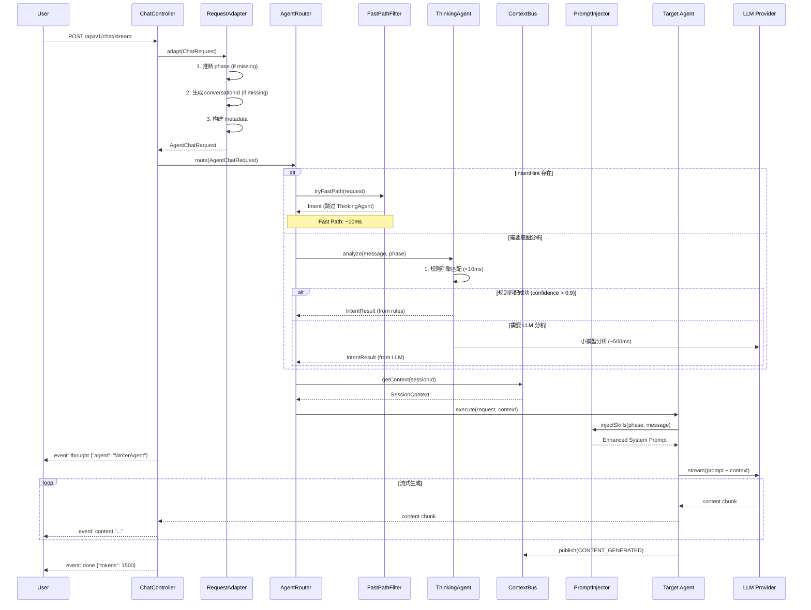

# Design Document: Orchestration Unification

## Overview

本设计文档定义了 InkFlow V2 的 Orchestration 架构统一方案，将 ChatController 集成到 AgentRouter 架构中，消除 `agent` 和 `ai_bridge` 模块的重复代码。

**核心变更**:
1. ChatController 不再直接调用 SpringAIChatService，改为通过 AgentRouter 路由
2. 合并两个 AgentOrchestrator 为统一实现
3. 废弃 ai_bridge/orchestration 目录

## Architecture

### 新架构总览

```mermaid
graph TB
    subgraph "Controller Layer"
        CC[ChatController<br/>/api/v1/chat]
        AC[AgentController<br/>/api/v2/agent]
    end
    
    subgraph "Adapter Layer"
        RA[RequestAdapter<br/>ChatRequest → AgentChatRequest]
    end
    
    subgraph "Routing Layer"
        AR[AgentRouter]
        FP[FastPathFilter]
        TA[ThinkingAgent]
    end
    
    subgraph "Agent Layer"
        WA[WriterAgent]
        CA[ChatAgent]
        PA[PlannerAgent]
        WBA[WorldBuilderAgent]
        CHA[CharacterAgent]
        CSA[ConsistencyAgent]
    end
    
    subgraph "Orchestration Layer"
        AO[AgentOrchestrator<br/>统一版本]
        SCO[SceneCreationOrchestrator<br/>统一版本]
        CB[ContextBus]
    end
    
    subgraph "Skill Layer"
        PI[PromptInjector]
        SR[SkillRegistry]
    end
    
    subgraph "Tool Layer"
        TR[ToolRegistry]
        RAG[RAGSearchTool]
        STYLE[StyleRetrieveTool]
    end
    
    subgraph "Deprecated"
        SACS[SpringAIChatService<br/>@Deprecated]
        AO_OLD[ai_bridge/AgentOrchestrator<br/>@Deprecated]
    end
    
    CC --> RA
    AC --> AR
    RA --> AR
    AR --> FP
    AR --> TA
    FP --> WA
    FP --> CA
    TA --> AR
    
    AR --> WA
    AR --> CA
    AR --> PA
    AR --> WBA
    AR --> CHA
    AR --> CSA
    
    WA --> PI
    WA --> TR
    AO --> CB
    SCO --> WA
    SCO --> CSA
```

### 请求处理时序图



## Components and Interfaces

### 1. RequestAdapter

将 ChatController 的请求格式转换为 AgentRouter 的请求格式：

```java
@Component
public class ChatRequestAdapter {
    
    private final PhaseInferenceService phaseInferenceService;
    
    /**
     * 将 ai_bridge ChatRequest 转换为 agent ChatRequest
     */
    public com.inkflow.module.agent.dto.ChatRequest adapt(
            com.inkflow.module.ai_bridge.dto.ChatRequest request,
            UUID userId,
            UUID projectId
    ) {
        // 1. 推断 phase
        CreationPhase phase = request.phase() != null 
            ? CreationPhase.valueOf(request.phase())
            : phaseInferenceService.inferPhase(projectId, request.message());
        
        // 2. 生成 conversationId
        String conversationId = request.conversationId() != null
            ? request.conversationId()
            : generateConversationId(userId, projectId);
        
        // 3. 构建 metadata
        Map<String, Object> metadata = Map.of(
            "userId", userId.toString(),
            "projectId", projectId.toString(),
            "source", "chat-controller"
        );
        
        return new com.inkflow.module.agent.dto.ChatRequest(
            request.message(),
            projectId,
            conversationId,
            phase,
            null,  // intentHint - 可从请求中提取
            metadata
        );
    }
    
    private String generateConversationId(UUID userId, UUID projectId) {
        return "conv_" + userId.toString().substring(0, 8) + "_" + projectId.toString().substring(0, 8);
    }
}
```

### 2. 重构后的 ChatController

```java
@RestController
@RequestMapping("/api/v1/chat")
@RequiredArgsConstructor
public class ChatController {
    
    private final AgentRouter agentRouter;
    private final ChatRequestAdapter requestAdapter;
    
    @PostMapping(value = "/stream", produces = MediaType.TEXT_EVENT_STREAM_VALUE)
    public Flux<ServerSentEvent<String>> streamChat(
            @AuthenticationPrincipal User user,
            @Valid @RequestBody ChatRequest request
    ) {
        // 1. 适配请求格式
        var agentRequest = requestAdapter.adapt(request, user.getId(), request.projectId());
        
        // 2. 通过 AgentRouter 路由
        return agentRouter.route(agentRequest);
    }
    
    @PostMapping("/simple")
    public ChatResponse simpleChat(
            @AuthenticationPrincipal User user,
            @Valid @RequestBody ChatRequest request
    ) {
        var agentRequest = requestAdapter.adapt(request, user.getId(), request.projectId());
        
        // 收集流式响应为完整响应
        String content = agentRouter.route(agentRequest)
            .filter(sse -> "content".equals(sse.event()))
            .map(ServerSentEvent::data)
            .collect(Collectors.joining())
            .block();
        
        return new ChatResponse(content, agentRequest.conversationId(), agentRequest.phase().name());
    }
}
```

### 3. 统一的 AgentOrchestrator

合并两个模块的 AgentOrchestrator，保留最佳特性：

```java
@Component
public class UnifiedAgentOrchestrator {
    
    private final ExecutorService virtualThreadExecutor = 
        Executors.newVirtualThreadPerTaskExecutor();
    private final ApplicationEventPublisher eventPublisher;
    private final ContextBus contextBus;
    
    // === 从 agent 模块保留 ===
    
    /**
     * 并行执行多个 Agent（带重试和超时）
     */
    public <T> CompletableFuture<List<T>> executeParallel(
            List<CapableAgent<?, T>> agents,
            Object input,
            Duration timeout
    ) {
        List<CompletableFuture<T>> futures = agents.stream()
            .map(agent -> CompletableFuture
                .supplyAsync(() -> executeWithRetry(agent, input), virtualThreadExecutor)
                .orTimeout(timeout.toMillis(), TimeUnit.MILLISECONDS))
            .toList();
        
        return CompletableFuture.allOf(futures.toArray(new CompletableFuture[0]))
            .thenApply(v -> futures.stream()
                .map(CompletableFuture::join)
                .toList());
    }
    
    /**
     * 带指数退避的重试执行
     */
    private <T> T executeWithRetry(CapableAgent<?, T> agent, Object input) {
        int maxRetries = 3;
        Duration backoff = Duration.ofMillis(100);
        
        for (int i = 0; i < maxRetries; i++) {
            try {
                return agent.execute((agent.getInputType().cast(input)));
            } catch (Exception e) {
                if (i == maxRetries - 1) throw e;
                try {
                    Thread.sleep(backoff.toMillis() * (1L << i));
                } catch (InterruptedException ie) {
                    Thread.currentThread().interrupt();
                    throw new RuntimeException(ie);
                }
            }
        }
        throw new IllegalStateException("Should not reach here");
    }
    
    // === 从 ai_bridge 模块合并 ===
    
    /**
     * 链式执行（保留 ChainExecutionContext）
     */
    public <T> T executeChain(
            ChainExecutionContext context,
            List<Function<ChainExecutionContext, ChainExecutionContext>> steps
    ) {
        ChainExecutionContext current = context;
        for (Function<ChainExecutionContext, ChainExecutionContext> step : steps) {
            try {
                current = step.apply(current);
            } catch (Exception e) {
                throw new ChainExecutionException("Chain execution failed at step", e, current);
            }
        }
        return (T) current.getResult();
    }
    
    /**
     * 类型安全的并行结果（保留 ParallelResult2/3）
     */
    public <T1, T2> ParallelResult2<T1, T2> executeParallel2(
            Supplier<T1> task1,
            Supplier<T2> task2
    ) {
        var future1 = CompletableFuture.supplyAsync(task1, virtualThreadExecutor);
        var future2 = CompletableFuture.supplyAsync(task2, virtualThreadExecutor);
        
        CompletableFuture.allOf(future1, future2).join();
        
        return new ParallelResult2<>(future1.join(), future2.join());
    }
    
    // === 竞争执行 ===
    
    /**
     * 任一成功即返回
     */
    public <T> T executeAny(List<Supplier<T>> tasks) {
        List<CompletableFuture<T>> futures = tasks.stream()
            .map(task -> CompletableFuture.supplyAsync(task, virtualThreadExecutor))
            .toList();
        
        return (T) CompletableFuture.anyOf(futures.toArray(new CompletableFuture[0])).join();
    }
}
```

### 4. 统一的 SceneCreationOrchestrator

```java
@Component
public class UnifiedSceneCreationOrchestrator {
    
    private final WriterAgent writerAgent;
    private final ConsistencyAgent consistencyAgent;
    private final HybridSearchService hybridSearchService;
    private final ApplicationEventPublisher eventPublisher;
    
    /**
     * 创建场景（流式）
     */
    public Flux<String> createScene(SceneRequest request) {
        // 1. RAG 检索相关上下文
        List<SearchResult> context = hybridSearchService.search(
            request.projectId(),
            request.prompt(),
            5
        );
        
        // 2. 发布思考事件
        eventPublisher.publishEvent(new AgentThoughtEvent("writer", "开始创作场景..."));
        
        // 3. 调用 WriterAgent 生成内容
        return writerAgent.stream(new WritingRequest(
            request.projectId(),
            request.prompt(),
            context,
            request.phase()
        ))
        .doOnComplete(() -> {
            // 4. 异步触发一致性检查
            Thread.startVirtualThread(() -> {
                consistencyAgent.execute(new ConsistencyRequest(
                    request.projectId(),
                    request.prompt()
                ));
            });
        });
    }
}
```

## Data Models

### ChainExecutionContext（从 ai_bridge 合并）

```java
public class ChainExecutionContext {
    private final Map<String, Object> data = new ConcurrentHashMap<>();
    private Object result;
    private Exception lastError;
    
    public <T> T get(String key, Class<T> type) {
        return type.cast(data.get(key));
    }
    
    public void put(String key, Object value) {
        data.put(key, value);
    }
    
    public Object getResult() { return result; }
    public void setResult(Object result) { this.result = result; }
}
```

### ParallelResult（从 ai_bridge 合并）

```java
public record ParallelResult2<T1, T2>(T1 first, T2 second) {}
public record ParallelResult3<T1, T2, T3>(T1 first, T2 second, T3 third) {}
```

## Correctness Properties

*A property is a characteristic or behavior that should hold true across all valid executions of a system.*

Property 1: Request adaptation preserves essential data
*For any* ChatRequest, adapting it to AgentChatRequest should preserve message, projectId, and conversationId (if provided).
**Validates: Requirements 2.1-2.4**

Property 2: Routing consistency
*For any* request routed through ChatController, the result should be identical to the same request routed through AgentController.
**Validates: Requirements 1.1, 6.1-6.4**

Property 3: SSE event type consistency
*For any* streaming response, all events should use one of the defined types: content, thought, tool_start, tool_end, done, error.
**Validates: Requirements 7.1-7.6**

Property 4: Chain execution preserves context
*For any* chain execution, the ChainExecutionContext should be passed through all steps and preserve accumulated data.
**Validates: Requirements 3.2, 8.1**

## Error Handling

| Error Scenario | Handling Strategy |
|----------------|-------------------|
| RequestAdapter 转换失败 | 返回 400 Bad Request |
| AgentRouter 路由失败 | 降级到 ChatAgent |
| ThinkingAgent 超时 | 使用规则引擎结果或默认 ChatAgent |
| Agent 执行失败 | 重试 3 次后返回错误事件 |
| LLM Provider 不可用 | 切换到备用 Provider |

## Testing Strategy

### Unit Tests
- ChatRequestAdapter 转换测试
- AgentRouter 路由测试
- UnifiedAgentOrchestrator 并行/链式执行测试

### Property-Based Tests (jqwik)
- Property 1: 请求适配数据保留
- Property 2: 路由一致性
- Property 3: SSE 事件类型一致性

### Integration Tests
- ChatController → AgentRouter 完整流程测试
- 废弃 SpringAIChatService 后的回归测试

## Migration Plan

### Phase 1: 添加适配层
1. 创建 ChatRequestAdapter
2. ChatController 注入 AgentRouter
3. 保留 SpringAIChatService 作为 fallback

### Phase 2: 切换路由
1. ChatController 默认使用 AgentRouter
2. 添加 feature flag 控制回退
3. 监控错误率

### Phase 3: 废弃旧代码
1. 标记 SpringAIChatService 为 @Deprecated
2. 标记 ai_bridge/orchestration 为 @Deprecated
3. 迁移所有调用方

### Phase 4: 清理
1. 移除 feature flag
2. 删除废弃代码（下个版本）

