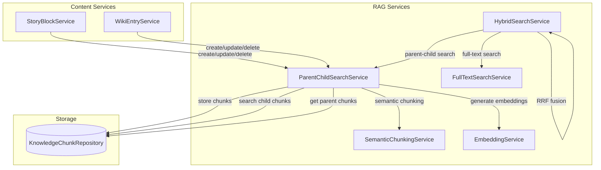

# Design Document: Parent-Child Search Integration

## Overview

本设计文档描述如何将 ParentChildSearchService 正确集成到 RAG 检索流程中，实现"小块检索，大块返回"策略。

核心改动包括：
1. 在内容服务（StoryBlockService、WikiEntryService）中集成父子块索引创建
2. 修改 HybridSearchService 使用 ParentChildSearchService 进行向量检索
3. 添加配置项控制检索策略
4. 确保向后兼容性

## Architecture



## Components and Interfaces

### 1. StoryBlockService 改动

在 StoryBlock 的 CRUD 操作中集成父子块索引：

```java
@Service
public class StoryBlockService {
    
    private final ParentChildSearchService parentChildSearchService;
    
    @Transactional
    public StoryBlock createBlock(...) {
        StoryBlock block = createBlockWithRank(...);
        
        // 异步创建父子块索引
        triggerIndexing(block);
        
        return block;
    }
    
    @Transactional
    public StoryBlock updateContent(UUID blockId, UUID chapterId, String content) {
        StoryBlock block = getBlock(blockId, chapterId);
        block.setContent(content);
        block = storyBlockRepository.save(block);
        
        // 异步重建父子块索引
        triggerIndexing(block);
        
        return block;
    }
    
    @Transactional
    public void deleteBlock(UUID blockId, UUID chapterId) {
        StoryBlock block = getBlock(blockId, chapterId);
        block.setDeleted(true);
        storyBlockRepository.save(block);
        
        // 异步删除父子块索引
        triggerIndexDeletion(block.getId());
    }
    
    @Async
    private void triggerIndexing(StoryBlock block) {
        parentChildSearchService.createParentChildIndex(
            block.getChapter().getVolume().getProjectId(),
            KnowledgeChunk.SOURCE_TYPE_STORY_BLOCK,
            block.getId(),
            block.getContent(),
            Map.of("title", block.getChapter().getTitle())
        ).subscribe();
    }
    
    @Async
    private void triggerIndexDeletion(UUID blockId) {
        knowledgeChunkRepository.deleteBySourceId(blockId);
    }
}
```

### 2. WikiEntryService 改动

类似地在 WikiEntry 的 CRUD 操作中集成：

```java
@Service
public class WikiEntryService {
    
    private final ParentChildSearchService parentChildSearchService;
    
    @Transactional
    public WikiEntry create(CreateWikiEntryRequest request, UUID projectId) {
        WikiEntry entry = // ... create entry
        
        // 异步创建父子块索引
        triggerIndexing(entry);
        
        return entry;
    }
    
    @Transactional
    public WikiEntry update(UUID entryId, UpdateWikiEntryRequest request) {
        WikiEntry entry = // ... update entry
        
        // 异步重建父子块索引
        triggerIndexing(entry);
        
        return entry;
    }
    
    @Async
    private void triggerIndexing(WikiEntry entry) {
        parentChildSearchService.createParentChildIndex(
            entry.getProjectId(),
            KnowledgeChunk.SOURCE_TYPE_WIKI_ENTRY,
            entry.getId(),
            entry.getContent(),
            Map.of(
                "title", entry.getTitle(),
                "type", entry.getType().name()
            )
        ).subscribe();
    }
}
```

### 3. HybridSearchService 改动

修改向量检索方法使用 ParentChildSearchService：

```java
@Service
public class HybridSearchService {
    
    private final ParentChildSearchService parentChildSearchService;
    private final RagProperties ragProperties;
    
    private Mono<List<SearchResult>> executeVectorSearch(UUID projectId, String query, int limit) {
        // 根据配置选择检索策略
        if (ragProperties.search().useParentChild()) {
            return parentChildSearchService.search(projectId, query, limit)
                .doOnNext(results -> log.debug("Parent-child search returned {} results", results.size()))
                .onErrorResume(error -> {
                    log.warn("Parent-child search failed, falling back to direct search: {}", error.getMessage());
                    return fallbackToDirectSearch(projectId, query, limit);
                });
        }
        
        return fallbackToDirectSearch(projectId, query, limit);
    }
    
    private Mono<List<SearchResult>> fallbackToDirectSearch(UUID projectId, String query, int limit) {
        return embeddingService.searchWithScore(projectId, query, limit)
            .doOnNext(results -> log.debug("Direct vector search returned {} results", results.size()))
            .onErrorResume(error -> {
                log.warn("Vector search failed: {}", error.getMessage());
                return Mono.just(Collections.emptyList());
            });
    }
}
```

### 4. RagProperties 配置扩展

添加检索策略配置：

```java
@ConfigurationProperties(prefix = "inkflow.rag")
public record RagProperties(
    HybridSearchConfig hybridSearch,
    SearchConfig search,  // 新增
    // ... 其他配置
) {
    public record SearchConfig(
        boolean useParentChild  // 是否使用父子块检索策略
    ) {
        public SearchConfig {
            // 默认启用父子块检索
            if (!useParentChild) useParentChild = true;
        }
        
        public static SearchConfig defaults() {
            return new SearchConfig(true);
        }
    }
}
```

对应的 YAML 配置：

```yaml
inkflow:
  rag:
    search:
      use-parent-child: true  # 默认启用父子块检索
```

## Data Models

### KnowledgeChunk 实体（已存在，无需修改）

```java
@Entity
public class KnowledgeChunk {
    public static final int CHUNK_LEVEL_PARENT = 0;
    public static final int CHUNK_LEVEL_CHILD = 1;
    
    private UUID id;
    private UUID projectId;
    private String sourceType;
    private UUID sourceId;
    private UUID parentId;      // 子块指向父块
    private String content;
    private float[] embedding;  // 父块为null，子块有值
    private int chunkLevel;     // 0=父块, 1=子块
    private int chunkOrder;     // 子块顺序
    private Map<String, Object> metadata;
}
```

### SearchResult DTO（已存在，无需修改）

```java
@Data
@Builder
public class SearchResult {
    private UUID id;
    private String sourceType;
    private UUID sourceId;
    private String content;
    private double similarity;
    private Map<String, Object> metadata;
    private int chunkLevel;
    private UUID parentId;
    private Integer chapterOrder;
    private Integer blockOrder;
    private Double rrfScore;
    private Double rerankerScore;
}
```

## Correctness Properties

*A property is a characteristic or behavior that should hold true across all valid executions of a system-essentially, a formal statement about what the system should do. Properties serve as the bridge between human-readable specifications and machine-verifiable correctness guarantees.*

### Property 1: Content indexing creates parent-child structure
*For any* content (StoryBlock or WikiEntry) that is created or updated, calling createParentChildIndex() should result in exactly one parent chunk without embedding and one or more child chunks with embeddings.
**Validates: Requirements 1.1, 1.4, 2.1, 2.4**

### Property 2: Content update replaces old chunks
*For any* content that is updated, the old parent and child chunks should be deleted before new chunks are created, ensuring no orphan chunks remain.
**Validates: Requirements 1.2, 2.2**

### Property 3: Content deletion cleans up all chunks
*For any* content that is deleted, all associated parent and child chunks should be removed from the repository.
**Validates: Requirements 1.3, 2.3**

### Property 4: Search deduplicates by parent and returns highest score
*For any* search query that matches multiple child chunks from the same parent, the result should contain only one entry per parent with the highest child similarity score.
**Validates: Requirements 3.2, 3.3**

### Property 5: Configuration controls search strategy
*For any* search request, when `use-parent-child` is true the system should use ParentChildSearchService, and when false it should use direct EmbeddingService.searchWithScore().
**Validates: Requirements 4.1, 4.2**

### Property 6: Index-search round-trip preserves relationships
*For any* content that is indexed, searching with a query matching that content should return results with correct parent-child relationships (parent content, child similarity score).
**Validates: Requirements 6.4**

Note: Since this is a new project, backward compatibility with legacy chunks (Requirements 5.x) is not required and has been removed from the design.

## Error Handling

### 索引创建失败

```java
@Async
private void triggerIndexing(StoryBlock block) {
    try {
        parentChildSearchService.createParentChildIndex(...)
            .doOnError(e -> log.error("索引创建失败: blockId={}, error={}", block.getId(), e.getMessage()))
            .onErrorResume(e -> Mono.empty())  // 不阻塞主流程
            .subscribe();
    } catch (Exception e) {
        log.error("触发索引失败: blockId={}", block.getId(), e);
        // 不抛出异常，不影响内容保存
    }
}
```

### 检索降级

```java
private Mono<List<SearchResult>> executeVectorSearch(...) {
    if (ragProperties.search().useParentChild()) {
        return parentChildSearchService.search(...)
            .onErrorResume(error -> {
                log.warn("父子块检索失败，降级到直接检索: {}", error.getMessage());
                return fallbackToDirectSearch(...);
            });
    }
    return fallbackToDirectSearch(...);
}
```

### 孤儿子块处理

```java
// ParentChildSearchService.search() 中
if (parentMap.isEmpty()) {
    // 父块未找到，返回子块内容作为降级
    return childResults.stream()
        .map(this::toSearchResult)
        .limit(limit)
        .collect(Collectors.toList());
}
```

## Testing Strategy

### 测试框架

- **单元测试**: JUnit 5 + Mockito
- **属性测试**: jqwik 1.9.0
- **集成测试**: Spring Boot Test + Testcontainers (PostgreSQL)

### 单元测试

1. **StoryBlockService 索引触发测试**
   - 验证 create/update/delete 操作触发正确的索引方法
   - 验证异步执行不阻塞主流程

2. **WikiEntryService 索引触发测试**
   - 验证 create/update 操作触发正确的索引方法
   - 验证 metadata 包含 title 和 type

3. **HybridSearchService 策略选择测试**
   - 验证配置为 true 时使用 ParentChildSearchService
   - 验证配置为 false 时使用 EmbeddingService
   - 验证降级逻辑正确执行

### 属性测试

使用 jqwik 实现以下属性测试：

```java
@PropertyDefaults(tries = 100)
class ParentChildSearchPropertyTest {
    
    /**
     * Property 1: Content indexing creates parent-child structure
     * Validates: Requirements 1.1, 1.4, 2.1, 2.4
     */
    @Property
    void indexingCreatesParentChildStructure(
        @ForAll @StringLength(min = 100, max = 5000) String content
    ) {
        // 调用 createParentChildIndex
        // 验证：1个父块无embedding，N个子块有embedding
    }
    
    /**
     * Property 4: Search deduplicates by parent and returns highest score
     * Validates: Requirements 3.2, 3.3
     */
    @Property
    void searchDeduplicatesByParent(
        @ForAll("validSearchQueries") String query,
        @ForAll @IntRange(min = 1, max = 20) int limit
    ) {
        // 创建多个子块指向同一父块
        // 执行搜索
        // 验证：每个父块只出现一次，保留最高分
    }
    
    /**
     * Property 7: Index-search round-trip preserves relationships
     * Validates: Requirements 6.4
     */
    @Property
    void roundTripPreservesRelationships(
        @ForAll("validContent") String content
    ) {
        // 索引内容
        // 搜索内容中的关键词
        // 验证：返回结果包含正确的父子关系
    }
}
```

### 集成测试

1. **端到端索引流程测试**
   - 创建 StoryBlock → 验证 KnowledgeChunk 表有正确的父子块
   - 更新 StoryBlock → 验证旧块删除、新块创建
   - 删除 StoryBlock → 验证所有块被清理

2. **端到端检索流程测试**
   - 索引多个内容 → 执行混合检索 → 验证返回父块内容
   - 验证 RRF 融合正确处理父子块结果
