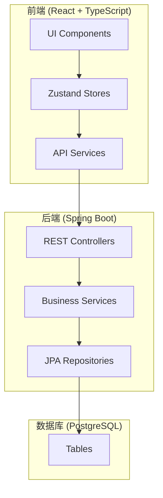

# Design Document: UI Enhancement V2

## Overview

本设计文档描述 InkFlow 2.0 UI 增强功能的技术实现方案，包括 AI 模型场景化配置、账户安全、导入导出扩展、主界面编辑功能和左侧边栏优化。

## Architecture

### 系统架构图



### 模块划分

1. **Scene Model Config Module** - AI 场景模型配置
2. **Account Security Module** - 账户安全管理
3. **Import Export Module** - 导入导出扩展
4. **Structure Editor Module** - 卷章节编辑
5. **Sidebar Enhancement Module** - 左侧边栏优化
6. **Resource Manager Module** - 项目资料管理

## Components and Interfaces

### 1. AI 任务模型配置

基于实际 AI 调用场景，定义任务类型（而非创作阶段）。用户可以为不同类型的 AI 任务配置不同的服务商和模型。

**设计理念：** 创作是非线性的，用户可能同时进行角色设计、大纲规划和正文写作。因此不使用"阶段"概念，而是基于"任务类型"来配置模型。

#### 任务类型定义

```java
// TaskType.java - AI 任务类型枚举
public enum TaskType {
    CONTENT_GENERATION,    // 内容生成（正文写作、续写）
    OUTLINE_PLANNING,      // 大纲规划
    CHARACTER_DESIGN,      // 角色设计
    WORLDBUILDING,         // 世界观构建
    CONSISTENCY_CHECK,     // 一致性检查
    STYLE_ANALYSIS,        // 风格分析
    BRAINSTORM,            // 头脑风暴/灵感
    REVISION               // 修订润色
}
```

#### 后端接口

```java
// TaskModelConfigController.java
@RestController
@RequestMapping("/api/task-configs")
public class TaskModelConfigController {
    
    @GetMapping
    List<TaskModelConfigDto> getAllConfigs(@AuthenticationPrincipal UserPrincipal user);
    
    @PutMapping("/{taskType}")
    TaskModelConfigDto saveConfig(
        @AuthenticationPrincipal UserPrincipal user,
        @PathVariable TaskType taskType,
        @RequestBody SaveTaskConfigRequest request
    );
    
    @DeleteMapping("/{taskType}")
    void deleteConfig(
        @AuthenticationPrincipal UserPrincipal user,
        @PathVariable TaskType taskType
    );
}
```

#### 前端组件

```typescript
// TaskModelPanel.tsx - 任务模型配置面板
interface TaskModelConfig {
  taskType: TaskType;
  providerType: ProviderType;
  model: string;
  isCustom: boolean;
}

type TaskType = 
  | 'CONTENT_GENERATION'
  | 'OUTLINE_PLANNING'
  | 'CHARACTER_DESIGN'
  | 'WORLDBUILDING'
  | 'CONSISTENCY_CHECK'
  | 'STYLE_ANALYSIS'
  | 'BRAINSTORM'
  | 'REVISION';

// 任务类型显示信息
const TASK_INFO: Record<TaskType, { name: string; description: string; icon: string }> = {
  CONTENT_GENERATION: { name: '内容生成', description: '正文写作、续写、扩写', icon: '✍️' },
  OUTLINE_PLANNING: { name: '大纲规划', description: '故事主线、分卷结构、章节大纲', icon: '📋' },
  CHARACTER_DESIGN: { name: '角色设计', description: '角色性格、背景、关系设定', icon: '👤' },
  WORLDBUILDING: { name: '世界构建', description: '世界观、力量体系、地理环境', icon: '🌍' },
  CONSISTENCY_CHECK: { name: '一致性检查', description: '检测设定冲突、逻辑漏洞', icon: '🔍' },
  STYLE_ANALYSIS: { name: '风格分析', description: '分析和学习写作风格', icon: '🎨' },
  BRAINSTORM: { name: '头脑风暴', description: '创意灵感、情节构思', icon: '💡' },
  REVISION: { name: '修订润色', description: '优化文笔、修复问题', icon: '✨' },
};
```

### 2. 账户安全模块

#### 后端接口

```java
// AccountSecurityController.java
@RestController
@RequestMapping("/api/account")
public class AccountSecurityController {
    
    @PutMapping("/password")
    void changePassword(
        @AuthenticationPrincipal UserPrincipal user,
        @RequestBody ChangePasswordRequest request
    );
    
    @GetMapping("/sessions")
    List<SessionDto> getActiveSessions(@AuthenticationPrincipal UserPrincipal user);
    
    @DeleteMapping("/sessions/{sessionId}")
    void revokeSession(
        @AuthenticationPrincipal UserPrincipal user,
        @PathVariable UUID sessionId
    );
    
    @DeleteMapping("/sessions")
    void revokeAllOtherSessions(
        @AuthenticationPrincipal UserPrincipal user,
        @RequestHeader("Authorization") String currentToken
    );
}
```

### 3. 导入导出扩展

#### 后端接口

```java
// ImportExportController.java (扩展现有)
@PostMapping("/export/txt/{projectId}")
ResponseEntity<Resource> exportAsTxt(@PathVariable UUID projectId);

@PostMapping("/export/zip/{projectId}")
ResponseEntity<Resource> exportAsZip(@PathVariable UUID projectId);

@PostMapping("/import/txt/{projectId}")
ImportResultDto importFromTxt(
    @PathVariable UUID projectId,
    @RequestParam("file") MultipartFile file
);

@PostMapping("/import/zip")
ImportResultDto importFromZip(@RequestParam("file") MultipartFile file);
```

### 4. 卷章节编辑

#### 前端组件

```typescript
// VolumeChapterTree.tsx - 卷章节树组件
interface VolumeChapterTreeProps {
  projectId: string;
  volumes: Volume[];
  onVolumeCreate: (title: string) => void;
  onChapterCreate: (volumeId: string, title: string) => void;
  onRename: (type: 'volume' | 'chapter', id: string, newTitle: string) => void;
  onDelete: (type: 'volume' | 'chapter', id: string) => void;
  onReorder: (type: 'volume' | 'chapter', id: string, newIndex: number) => void;
}

// ContextMenu.tsx - 右键菜单组件
interface ContextMenuProps {
  items: ContextMenuItem[];
  position: { x: number; y: number };
  onClose: () => void;
}
```

### 5. 左侧边栏优化

#### 前端组件

```typescript
// ContextualSidebar.tsx - 上下文相关侧边栏
interface ContextualSidebarProps {
  currentChapterId: string;
  characters: Character[];
  wikiEntries: WikiEntry[];
  plotLoops: PlotLoop[];
  onItemClick: (type: string, id: string) => void;
}

// 相关性计算服务
interface RelevanceService {
  getRelevantCharacters(chapterId: string): Promise<Character[]>;
  getRelevantWikiEntries(chapterId: string): Promise<WikiEntry[]>;
}
```

### 6. 项目资料管理

项目资料包含所有与项目相关的数据，基于现有后端实体：
- **Project (项目)** - 小说项目基本信息（标题、简介、创作阶段等）
- **Volume (卷)** - 小说分卷结构
- **Chapter (章节)** - 章节内容
- **Character (人物)** - 角色设定
- **WikiEntry (Wiki)** - 世界观设定
- **PlotLoop (伏笔)** - 伏笔/悬念
- **StyleSample (风格样本)** - 写作风格样本
- **ConsistencyWarning (一致性警告)** - 设定冲突提醒

#### 前端组件

```typescript
// ResourceManagerPanel.tsx - 资料管理面板
type ResourceType = 'project' | 'volumes' | 'chapters' | 'characters' | 'wiki' | 'plotLoops' | 'styleSamples' | 'warnings';

interface ResourceManagerPanelProps {
  projectId: string;
  activeTab: ResourceType;
  onTabChange: (tab: ResourceType) => void;
}

// ResourceList.tsx - 通用资料列表
interface ResourceListProps<T> {
  items: T[];
  resourceType: ResourceType;
  searchQuery: string;
  onSearch: (query: string) => void;
  onCreate: () => void;
  onEdit: (id: string) => void;
  onDelete: (id: string) => void;
  renderItem: (item: T) => React.ReactNode;
}

// ResourceEditor.tsx - 通用资料编辑器
interface ResourceEditorProps {
  resourceType: ResourceType;
  resourceId?: string; // 新建时为空
  projectId: string;
  onSave: (data: any) => void;
  onCancel: () => void;
}

// 资料类型配置
const RESOURCE_CONFIG: Record<ResourceType, {
  name: string;
  icon: string;
  canCreate: boolean;
  canEdit: boolean;
  canDelete: boolean;
  isSingleton: boolean; // 是否单例（如 project）
}> = {
  project: { name: '项目信息', icon: '�', cannCreate: false, canEdit: true, canDelete: false, isSingleton: true },
  volumes: { name: '卷', icon: '�',  canCreate: true, canEdit: true, canDelete: true, isSingleton: false },
  chapters: { name: '章节', icon: '�', caanCreate: true, canEdit: true, canDelete: true, isSingleton: false },
  characters: { name: '人物', icon: '👤', canCreate: true, canEdit: true, canDelete: true, isSingleton: false },
  wiki: { name: 'Wiki', icon: '📖', canCreate: true, canEdit: true, canDelete: true, isSingleton: false },
  plotLoops: { name: '伏笔', icon: '🔗', canCreate: true, canEdit: true, canDelete: true, isSingleton: false },
  styleSamples: { name: '风格样本', icon: '✍️', canCreate: false, canEdit: false, canDelete: true, isSingleton: false },
  warnings: { name: '一致性警告', icon: '⚠️', canCreate: false, canEdit: false, canDelete: true, isSingleton: false },
};
```

## Data Models

### AI 任务模型配置表

```sql
CREATE TABLE task_model_configs (
    id UUID PRIMARY KEY DEFAULT gen_random_uuid(),
    user_id UUID NOT NULL REFERENCES users(id),
    task_type VARCHAR(50) NOT NULL,  -- 使用 TaskType 枚举值
    provider_type VARCHAR(50) NOT NULL,
    model VARCHAR(100) NOT NULL,
    created_at TIMESTAMP DEFAULT CURRENT_TIMESTAMP,
    updated_at TIMESTAMP DEFAULT CURRENT_TIMESTAMP,
    deleted BOOLEAN NOT NULL DEFAULT false,
    deleted_at TIMESTAMP,
    UNIQUE(user_id, task_type)
);

CREATE INDEX idx_task_model_configs_user ON task_model_configs(user_id);
```

### 会话信息扩展

```sql
-- 扩展 refresh_tokens 表，添加更多设备信息
ALTER TABLE refresh_tokens ADD COLUMN user_agent VARCHAR(500);
ALTER TABLE refresh_tokens ADD COLUMN last_used_at TIMESTAMP;
```

## Correctness Properties

*A property is a characteristic or behavior that should hold true across all valid executions of a system-essentially, a formal statement about what the system should do. Properties serve as the bridge between human-readable specifications and machine-verifiable correctness guarantees.*

### Property 1: 任务模型配置 Round-Trip 一致性
*For any* 任务类型和模型配置组合，保存配置后查询该任务类型应返回相同的服务商和模型设置。
**Validates: Requirements 1.2**

### Property 2: 任务模型路由正确性
*For any* 已配置的任务类型，执行该类型的 AI 任务时，系统应使用配置的服务商和模型；对于未配置的任务类型，应使用默认配置。
**Validates: Requirements 1.3, 1.4**

### Property 3: 密码更新 Round-Trip
*For any* 符合强度要求的新密码，更新密码后应能使用新密码成功登录，旧密码应失效。
**Validates: Requirements 2.2**

### Property 4: 会话管理一致性
*For any* 用户的活跃会话列表，撤销某个会话后该会话的令牌应立即失效；撤销所有其他会话后，只有当前会话的令牌有效。
**Validates: Requirements 2.3, 2.4, 2.5**

### Property 5: 导出导入 Round-Trip
*For any* 有效的项目数据，导出为 ZIP 后再导入应还原相同的项目结构（卷、章节、人物、Wiki、伏笔）。
**Validates: Requirements 3.2, 3.4**

### Property 6: TXT 导出内容完整性
*For any* 项目，导出的 TXT 文件应包含所有章节的正文内容，且顺序与项目结构一致。
**Validates: Requirements 3.1**

### Property 7: 无效文件导入错误处理
*For any* 格式不正确的导入文件，系统应抛出明确的错误并中止导入，不应修改任何现有数据。
**Validates: Requirements 3.5**

### Property 8: 章节排序持久化
*For any* 章节拖拽排序操作，刷新页面后章节顺序应保持不变。
**Validates: Requirements 4.4**

### Property 9: 上下文相关内容排序
*For any* 章节，左侧边栏的人物和 Wiki 列表中，与该章节相关的条目应排在列表前面。
**Validates: Requirements 5.2, 5.3**

### Property 10: 资料搜索完整性
*For any* 搜索查询，搜索结果应包含所有名称或内容匹配该查询的资料条目。
**Validates: Requirements 6.3**

## Error Handling

### 前端错误处理

```typescript
// 统一错误处理
const handleApiError = (error: ApiError) => {
  switch (error.code) {
    case 'VALIDATION_ERROR':
      toast.error(error.details?.message || '输入验证失败');
      break;
    case 'UNAUTHORIZED':
      // 跳转登录
      break;
    case 'NOT_FOUND':
      toast.error('资源不存在');
      break;
    default:
      toast.error('操作失败，请重试');
  }
};
```

### 后端错误处理

```java
// 业务异常
public class SceneConfigNotFoundException extends BusinessException {
    public SceneConfigNotFoundException(SceneType sceneType) {
        super("场景配置不存在: " + sceneType);
    }
}

// 导入错误
public class ImportFormatException extends BusinessException {
    public ImportFormatException(String format, String reason) {
        super("导入格式错误 [" + format + "]: " + reason);
    }
}
```

## Testing Strategy

### 单元测试

- 使用 JUnit 5 + Mockito 测试后端服务层
- 使用 Vitest + React Testing Library 测试前端组件
- 测试覆盖核心业务逻辑和边界条件

### 属性测试

- 使用 **jqwik** 进行属性测试（Java）
- 使用 **fast-check** 进行属性测试（TypeScript）
- 每个属性测试运行至少 100 次迭代
- 测试注释格式：`**Feature: ui-enhancement-v2, Property {number}: {property_text}**`

### 属性测试示例

```java
// TaskModelConfigPropertyTest.java
@PropertyDefaults(tries = 100)
class TaskModelConfigPropertyTest {
    
    /**
     * **Feature: ui-enhancement-v2, Property 1: 任务模型配置 Round-Trip 一致性**
     * **Validates: Requirements 1.2**
     */
    @Property
    void configRoundTrip(
        @ForAll TaskType taskType,
        @ForAll("validProviderTypes") ProviderType providerType,
        @ForAll @StringLength(min = 1, max = 50) String model
    ) {
        // 保存配置
        var request = new SaveTaskConfigRequest(providerType, model);
        service.saveConfig(testUserId, taskType, request);
        
        // 查询配置
        var config = service.getConfig(testUserId, taskType);
        
        // 验证一致性
        assertThat(config.providerType()).isEqualTo(providerType);
        assertThat(config.model()).isEqualTo(model);
    }
}
```

```typescript
// import-export.property.test.ts
import fc from 'fast-check';

/**
 * **Feature: ui-enhancement-v2, Property 5: 导出导入 Round-Trip**
 * **Validates: Requirements 3.2, 3.4**
 */
test('export import round trip preserves project structure', () => {
  fc.assert(
    fc.property(
      projectArbitrary(),
      async (project) => {
        const exported = await exportService.exportAsZip(project.id);
        const imported = await importService.importFromZip(exported);
        
        expect(imported.volumes.length).toBe(project.volumes.length);
        expect(imported.characters.length).toBe(project.characters.length);
        expect(imported.wikiEntries.length).toBe(project.wikiEntries.length);
      }
    ),
    { numRuns: 100 }
  );
});
```

### 集成测试

- 使用 @SpringBootTest 测试完整 API 流程
- 使用 Playwright 进行 E2E 测试
- 测试关键用户流程：配置保存、密码修改、导入导出
