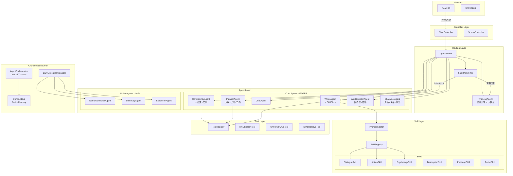
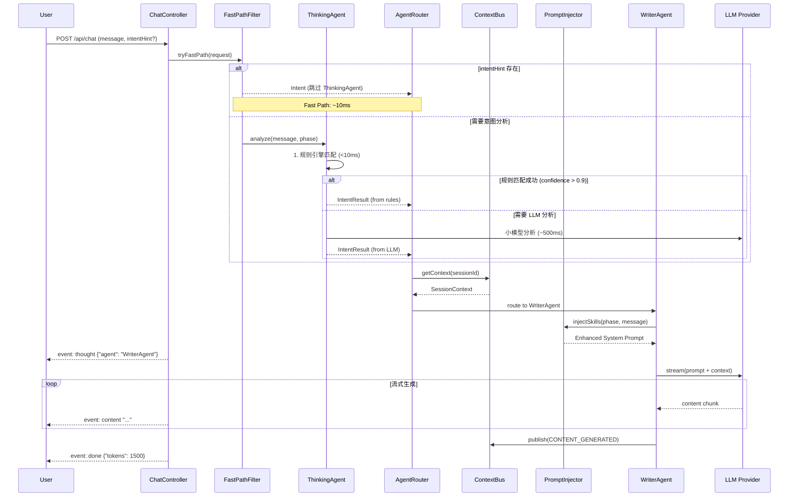
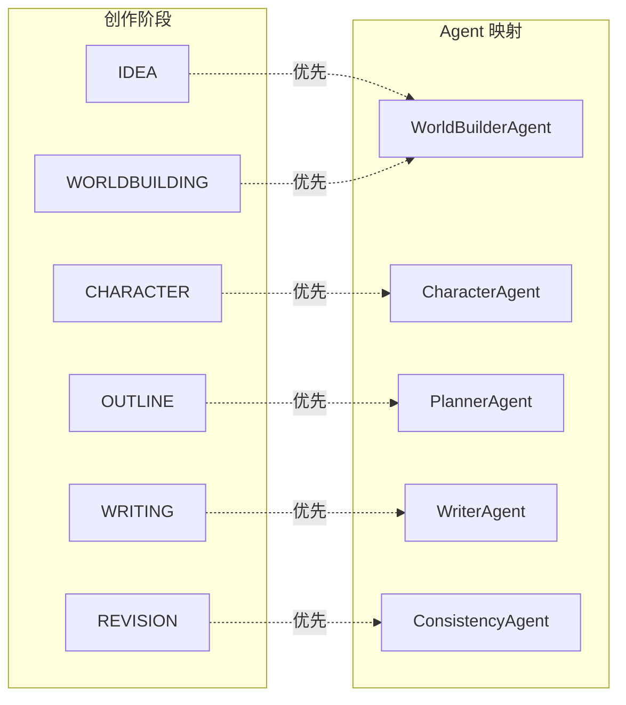

# Design Document: Unified Agent Architecture (精简版)

## Overview

本设计文档定义了 InkFlow V2 的统一 Agent 架构，采用精简的 10 Agent 方案，将现有的单一 LLM 调用模式重构为分层的多 Agent 协作系统。

**核心设计原则：**
1. **性能优先** - Fast Path 机制减少不必要的 LLM 调用
2. **成本可控** - 懒执行模式避免 Token 浪费
3. **职责清晰** - 10 个 Agent 各司其职，通过 Skill Slots 扩展能力
4. **上下文共享** - Context Bus 解决 Agent 间数据同步

**Agent 精简方案（18 → 10）：**
- 路由层：ThinkingAgent, ChatAgent
- 创作层：WorldBuilderAgent, CharacterAgent, PlannerAgent, WriterAgent
- 质量层：ConsistencyAgent
- 工具层：NameGeneratorAgent, SummaryAgent, ExtractionAgent

## Architecture

### 系统总体架构图



### 请求处理流程图



### Agent 与创作阶段映射



## Components and Interfaces

### 1. Fast Path Filter

```java
public interface FastPathFilter {
    Optional<Intent> tryFastPath(ChatRequest request);
}

public record FastPathResult(
    boolean canSkip,
    Intent intent,
    String targetAgent
) {}
```

**Fast Path 触发条件：**
- 前端传递明确的 `intentHint` 参数
- 用户点击特定功能按钮（如"生成大纲"、"续写"）
- 消息以特定命令前缀开头（如 `/write`、`/plan`）

### 2. Agent Router

```java
public interface AgentRouter {
    Flux<ServerSentEvent<String>> route(ChatRequest request);
    List<AgentCapability> getCapabilities();
}

public record AgentCapability(
    String agentName,
    AgentCategory category,
    List<Intent> supportedIntents,
    List<CreationPhase> applicablePhases,
    List<String> requiredTools,
    ExecutionMode executionMode,
    int estimatedLatencyMs,
    int estimatedTokenCost
) {}

public enum ExecutionMode { EAGER, LAZY }
public enum AgentCategory { ROUTING, CREATIVE, QUALITY, UTILITY }
```

### 3. Context Bus

```java
public interface ContextBus {
    void publish(String sessionId, ContextEvent event);
    SessionContext getContext(String sessionId);
    Flux<ContextEvent> subscribe(String sessionId);
}

public record SessionContext(
    String sessionId,
    UUID projectId,
    CreationPhase currentPhase,
    List<RecentEntity> recentEntities,
    Map<String, Object> workingMemory
) {}

public record ContextEvent(
    String eventType,
    String sourceAgent,
    Object payload,
    LocalDateTime timestamp
) {}
```

### 4. Skill Slots 架构

```java
public interface SkillSlot {
    String getId();
    String getName();
    Set<Class<? extends Agent>> getApplicableAgents();
    Set<CreationPhase> getApplicablePhases();
    String generatePromptFragment(SkillContext context);
    int getPriority();
    boolean isEnabled();
}

public record SkillContext(
    UUID projectId,
    CreationPhase currentPhase,
    String userMessage,
    Map<String, Object> metadata,
    SessionContext sessionContext
) {}
```

#### 内置 Skills 分配

| Agent | Skills |
|-------|--------|
| WriterAgent | DialogueSkill, ActionSkill, PsychologySkill, DescriptionSkill, PlotLoopReminderSkill, PolishSkill |
| CharacterAgent | RelationshipSkill, ArchetypeSkill, BackstorySkill |
| PlannerAgent | OutlineSkill, PlotLoopSkill, PacingSkill |

#### Skill Registry

```java
@Component
public class SkillRegistry {
    private final Map<String, SkillSlot> skills = new ConcurrentHashMap<>();
    
    @PostConstruct
    public void autoDiscover() {
        applicationContext.getBeansOfType(SkillSlot.class)
            .values()
            .forEach(skill -> skills.put(skill.getId(), skill));
    }
    
    public List<SkillSlot> getSkillsFor(Class<? extends Agent> agentClass, CreationPhase phase) {
        return skills.values().stream()
            .filter(SkillSlot::isEnabled)
            .filter(s -> s.getApplicableAgents().contains(agentClass))
            .filter(s -> s.getApplicablePhases().contains(phase))
            .sorted(Comparator.comparingInt(SkillSlot::getPriority).reversed())
            .toList();
    }
}
```

#### Prompt Injector

```java
@Component
public class PromptInjector {
    private final SkillRegistry skillRegistry;
    
    public String buildEnhancedSystemPrompt(
        String baseSystemPrompt,
        Class<? extends Agent> agentClass,
        SkillContext context
    ) {
        List<SkillSlot> skills = skillRegistry.getSkillsFor(agentClass, context.currentPhase());
        
        StringBuilder enhanced = new StringBuilder(baseSystemPrompt);
        enhanced.append("\n\n=== 已激活的技能 ===\n");
        
        for (SkillSlot skill : skills) {
            String fragment = skill.generatePromptFragment(context);
            if (fragment != null && !fragment.isBlank()) {
                enhanced.append("\n").append(fragment);
            }
        }
        return enhanced.toString();
    }
}
```

### 5. Agent 实现

#### 5.1 ThinkingAgent

```java
@Component
public class ThinkingAgent {
    private final RuleBasedClassifier ruleClassifier;
    private final ChatModel lightweightModel;
    
    public IntentResult analyze(String message, CreationPhase phase) {
        // 1. 规则匹配 (<10ms)
        Optional<Intent> ruleResult = ruleClassifier.classify(message);
        if (ruleResult.isPresent() && ruleResult.get().confidence() > 0.9) {
            return IntentResult.fromRule(ruleResult.get());
        }
        // 2. 小模型分析 (~500ms)
        return lightweightModel.analyze(message, phase);
    }
}
```

#### 5.2 WriterAgent (with Skill Slots)

```java
@Component
public class WriterAgent extends AbstractAgent<WritingRequest, WritingResult> {
    private final PromptInjector promptInjector;
    
    @Override
    public Flux<String> stream(WritingRequest request) {
        SkillContext skillContext = new SkillContext(
            request.getProjectId(),
            request.getCurrentPhase(),
            request.getPrompt(),
            request.getMetadata(),
            contextBus.getContext(request.getSessionId())
        );
        
        String enhancedPrompt = promptInjector.buildEnhancedSystemPrompt(
            getSystemPrompt(), WriterAgent.class, skillContext
        );
        
        return chatClient.prompt()
            .system(enhancedPrompt)
            .user(buildUserPrompt(request))
            .stream()
            .content();
    }
}
```

#### 5.3 WorldBuilderAgent (合并 IdeaAgent)

```java
@Component
public class WorldBuilderAgent extends AbstractAgent<WorldBuildingRequest, WorldBuildingResult> {
    
    @Override
    public AgentCapability getCapability() {
        return new AgentCapability(
            "WorldBuilderAgent",
            AgentCategory.CREATIVE,
            List.of(Intent.PLAN_WORLD, Intent.BRAINSTORM_IDEA),
            List.of(CreationPhase.IDEA, CreationPhase.WORLDBUILDING),
            List.of("RAGSearchTool"),
            ExecutionMode.EAGER,
            3000, 1500
        );
    }
    
    @Override
    protected String getSystemPrompt() {
        return """
            你是一位世界观架构师，负责设计小说的世界设定和激发创意灵感。
            
            职责：
            1. 灵感激发：根据模糊概念生成多个创意方向
            2. 世界观设计：构建地理、历史、文化、力量体系
            3. 确保设定内部一致性
            4. 输出结构化 JSON 用于 WikiEntry 创建
            """;
    }
}
```

#### 5.4 CharacterAgent (合并 RelationshipAgent + ArchetypeAgent)

```java
@Component
public class CharacterAgent extends AbstractAgent<CharacterRequest, CharacterResult> {
    
    @Override
    public AgentCapability getCapability() {
        return new AgentCapability(
            "CharacterAgent",
            AgentCategory.CREATIVE,
            List.of(Intent.PLAN_CHARACTER, Intent.DESIGN_RELATIONSHIP, Intent.MATCH_ARCHETYPE),
            List.of(CreationPhase.CHARACTER),
            List.of("RAGSearchTool"),
            ExecutionMode.EAGER,
            2500, 1200
        );
    }
    
    @Override
    protected String getSystemPrompt() {
        return """
            你是一位角色设计专家，负责创建立体的角色和关系网络。
            
            职责：
            1. 角色设计：性格、背景、动机、缺陷
            2. 关系网络：设计角色间的关系和冲突
            3. 原型匹配：基于荣格原型理论提供建议
            4. 输出结构化 JSON 用于 Character 创建
            """;
    }
}
```

#### 5.5 PlannerAgent (合并 PlotLoopAgent + PacingAgent)

```java
@Component
public class PlannerAgent extends AbstractAgent<PlanningRequest, PlanningResult> {
    
    @Override
    public AgentCapability getCapability() {
        return new AgentCapability(
            "PlannerAgent",
            AgentCategory.CREATIVE,
            List.of(Intent.PLAN_OUTLINE, Intent.MANAGE_PLOTLOOP, Intent.ANALYZE_PACING),
            List.of(CreationPhase.OUTLINE),
            List.of("RAGSearchTool"),
            ExecutionMode.EAGER,
            3000, 1500
        );
    }
    
    @Override
    protected String getSystemPrompt() {
        return """
            你是一位故事结构专家，负责大纲规划、伏笔管理和节奏控制。
            
            职责：
            1. 大纲规划：设计章节结构和故事节拍
            2. 伏笔管理：埋设伏笔、追踪回收时机
            3. 节奏控制：分析张力曲线、建议调整
            4. 输出结构化 JSON 用于大纲存储
            """;
    }
}
```

#### 5.6 ConsistencyAgent (合并 StyleAgent)

```java
@Component
public class ConsistencyAgent extends AbstractAgent<ConsistencyRequest, ConsistencyResult> {
    
    @Override
    public AgentCapability getCapability() {
        return new AgentCapability(
            "ConsistencyAgent",
            AgentCategory.QUALITY,
            List.of(Intent.CHECK_CONSISTENCY, Intent.ANALYZE_STYLE),
            List.of(CreationPhase.WRITING, CreationPhase.REVISION),
            List.of("RAGSearchTool", "StyleRetrieveTool"),
            ExecutionMode.EAGER,
            2000, 800
        );
    }
    
    @Override
    protected String getSystemPrompt() {
        return """
            你是一位质量保障专家，负责一致性检查和文风分析。
            
            职责：
            1. 一致性检查：角色、设定、时间线的逻辑一致性
            2. 文风分析：提取和维护统一的写作风格
            3. 返回警告列表和修正建议
            """;
    }
}
```

### 6. Lazy Execution Manager

```java
@Component
public class LazyExecutionManager {
    private static final Set<Class<? extends Agent>> LAZY_AGENTS = Set.of(
        NameGeneratorAgent.class,
        SummaryAgent.class,
        ExtractionAgent.class
    );
    
    public boolean shouldExecute(Class<? extends Agent> agentClass, ExecutionContext ctx) {
        if (!LAZY_AGENTS.contains(agentClass)) return true;
        return ctx.isManuallyTriggered() || ctx.meetsAutoTriggerConditions();
    }
}
```

## Data Models

### Intent 枚举

```java
public enum Intent {
    // 内容生成类
    WRITE_CONTENT("写作", "续写", "扩写", "生成"),
    
    // 世界观类
    PLAN_WORLD("世界观", "设定", "力量体系"),
    BRAINSTORM_IDEA("灵感", "创意", "想法"),
    
    // 角色类
    PLAN_CHARACTER("角色", "人物"),
    DESIGN_RELATIONSHIP("关系", "人际"),
    MATCH_ARCHETYPE("原型", "类型"),
    
    // 规划类
    PLAN_OUTLINE("大纲", "规划", "结构"),
    MANAGE_PLOTLOOP("伏笔", "埋线", "回收"),
    ANALYZE_PACING("节奏", "张力"),
    
    // 质量类
    CHECK_CONSISTENCY("检查", "一致性", "矛盾"),
    ANALYZE_STYLE("文风", "风格"),
    
    // 工具类
    GENERATE_NAME("起名", "名字"),
    EXTRACT_ENTITY("抽取", "提取"),
    SUMMARIZE("摘要", "总结"),
    
    // 通用
    GENERAL_CHAT("聊天", "问答", "帮助");
    
    private final String[] keywords;
}
```

### SSE Event Types

```java
public enum SSEEventType {
    CONTENT("content"),
    THOUGHT("thought"),
    TOOL_START("tool_start"),
    TOOL_END("tool_end"),
    DATA_BLOCK("data_block"),
    WARNING("warning"),
    ERROR("error"),
    DONE("done");
}
```

## Error Handling

```mermaid
graph TB
    subgraph "Error Scenarios"
        E1[ThinkingAgent 超时]
        E2[RAGSearchTool 失败]
        E3[ConsistencyAgent 失败]
        E4[LLM Provider 不可用]
    end
    
    subgraph "Degradation Strategies"
        D1[使用规则引擎结果或默认 ChatAgent]
        D2[继续生成，标记"未使用上下文"]
        D3[跳过一致性检查，返回警告]
        D4[切换到备用 Provider 或本地模型]
    end
    
    E1 --> D1
    E2 --> D2
    E3 --> D3
    E4 --> D4
```

## Testing Strategy

### Property-Based Testing (jqwik)

本项目使用 jqwik 进行属性测试，验证系统的正确性属性。

**测试框架配置：**
- 每个属性测试运行至少 100 次迭代
- 使用 `@Property` 注解标记属性测试
- 每个测试必须注释引用的正确性属性

## Correctness Properties

*A property is a characteristic or behavior that should hold true across all valid executions of a system-essentially, a formal statement about what the system should do. Properties serve as the bridge between human-readable specifications and machine-verifiable correctness guarantees.*

### Acceptance Criteria Testing Prework

1.1 WHEN a user sends a chat message THEN the AgentRouter SHALL analyze the message intent and route to the appropriate Agent
  Thoughts: 这是关于路由正确性的属性。我们可以生成随机消息和意图，验证路由结果是否正确。
  Testable: yes - property

1.2-1.9 路由到特定 Agent 的规则
  Thoughts: 这些是具体的路由规则，可以通过生成包含特定关键词的消息来测试。
  Testable: yes - property

2.1 WHEN the request contains an intentHint parameter THEN the FastPathFilter SHALL skip ThinkingAgent
  Thoughts: 可以生成带有 intentHint 的请求，验证是否跳过了 ThinkingAgent。
  Testable: yes - property

3.1-3.2 ThinkingAgent 规则引擎优先
  Thoughts: 可以测试规则引擎的置信度阈值行为。
  Testable: yes - property

4.3 WHEN generating content THEN the PromptInjector SHALL inject applicable skills
  Thoughts: 可以验证不同阶段和消息类型下，正确的 Skills 被注入。
  Testable: yes - property

16.4 WHEN multiple sessions exist THEN the ContextBus SHALL ensure session isolation
  Thoughts: 可以创建多个 session，验证数据隔离。
  Testable: yes - property

17.3 WHEN a skill generates a prompt fragment THEN the PromptInjector SHALL append it in priority order
  Thoughts: 可以验证 Skills 按优先级顺序注入。
  Testable: yes - property

### Correctness Properties

Property 1: Intent-based routing correctness
*For any* user message containing specific intent keywords, the AgentRouter should route to the corresponding Agent type.
**Validates: Requirements 1.1-1.9**

Property 2: Fast Path skip behavior
*For any* request with a valid intentHint parameter, the FastPathFilter should return a result without invoking ThinkingAgent.
**Validates: Requirements 2.1**

Property 3: Rule engine priority
*For any* message where rule-based classification confidence exceeds 0.9, ThinkingAgent should return result without LLM call.
**Validates: Requirements 3.1-3.2**

Property 4: Skill injection by phase
*For any* Agent and CreationPhase combination, the PromptInjector should inject only skills that are applicable to both.
**Validates: Requirements 4.3, 17.3**

Property 5: Session isolation
*For any* two different session IDs, publishing a ContextEvent to one session should not affect the other session's context.
**Validates: Requirements 16.4**

Property 6: Skill priority ordering
*For any* set of applicable skills, the PromptInjector should inject them in descending priority order.
**Validates: Requirements 17.3**

## Configuration

```yaml
inkflow:
  agent:
    fast-path:
      enabled: true
      command-prefixes: ["/write", "/plan", "/check", "/name"]
    
    thinking:
      rule-confidence-threshold: 0.9
      llm-model: deepseek-chat-7b
      timeout-ms: 2000
    
    lazy-execution:
      auto-trigger:
        summary: after-chapter-complete
        extraction: after-content-save
    
    skills:
      enabled: true
      auto-select:
        enabled: true
        keywords:
          dialogue: ["对话", "说", "问", "答"]
          action: ["打斗", "战斗", "动作"]
          psychology: ["心理", "想法", "感受"]
          description: ["环境", "场景", "描写"]
```
