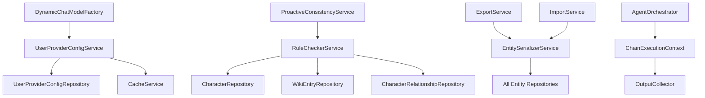

# Design Document: V2 Defects Completion

## Overview

本设计文档描述了 InkFlow V2 后端缺陷修复的技术方案。这些缺陷包括未实现的功能、简化实现、空返回值问题和缺失的测试覆盖。设计遵循现有的 V2 架构模式，使用 Spring Boot 3.5.x + Spring AI 1.1.2 + Java 22 技术栈。

## Architecture

### 高层架构

```
┌─────────────────────────────────────────────────────────────────┐
│                        API Layer                                 │
│  ┌─────────────┐  ┌─────────────┐  ┌─────────────────────────┐  │
│  │ ChatController│ │ConsistencyCtrl│ │ ProjectController      │  │
│  └──────┬──────┘  └──────┬──────┘  └───────────┬─────────────┘  │
└─────────┼────────────────┼─────────────────────┼────────────────┘
          │                │                     │
┌─────────┼────────────────┼─────────────────────┼────────────────┐
│         │          Service Layer               │                 │
│  ┌──────▼──────┐  ┌──────▼──────┐  ┌──────────▼──────────────┐  │
│  │DynamicChat  │  │Proactive    │  │Export/Import            │  │
│  │ModelFactory │  │Consistency  │  │Service                  │  │
│  │(Enhanced)   │  │Service      │  │(Complete)               │  │
│  └──────┬──────┘  └──────┬──────┘  └──────────┬──────────────┘  │
│         │                │                     │                 │
│  ┌──────▼──────┐  ┌──────▼──────┐  ┌──────────▼──────────────┐  │
│  │UserProvider │  │RuleChecker  │  │EntitySerializer         │  │
│  │ConfigService│  │Service      │  │Service                  │  │
│  └─────────────┘  └─────────────┘  └─────────────────────────┘  │
└─────────────────────────────────────────────────────────────────┘
          │                │                     │
┌─────────┼────────────────┼─────────────────────┼────────────────┐
│         │          Repository Layer            │                 │
│  ┌──────▼──────┐  ┌──────▼──────┐  ┌──────────▼──────────────┐  │
│  │UserProvider │  │Character    │  │All Entity               │  │
│  │ConfigRepo   │  │WikiEntry    │  │Repositories             │  │
│  │             │  │Relationship │  │                         │  │
│  └─────────────┘  └─────────────┘  └─────────────────────────┘  │
└─────────────────────────────────────────────────────────────────┘
```

### 模块依赖关系



## Components and Interfaces

### 1. UserProviderConfigService (新增)

```java
@Service
public class UserProviderConfigService {
    
    private final UserProviderConfigRepository repository;
    private final CacheService cacheService;
    
    private static final String CACHE_PREFIX = "user:provider:config:";
    private static final Duration CACHE_TTL = Duration.ofMinutes(5);
    
    public Optional<UserProviderConfig> getUserConfig(UUID userId) {
        // 1. 检查缓存
        // 2. 查询数据库
        // 3. 更新缓存
        // 4. 返回配置或 Optional.empty()
    }
    
    public void saveUserConfig(UUID userId, UserProviderConfig config) {
        // 保存并更新缓存
    }
    
    public void invalidateCache(UUID userId) {
        // 清除用户缓存
    }
}
```

### 2. RuleCheckerService (新增)

```java
@Service
public class RuleCheckerService {
    
    private final CharacterRepository characterRepository;
    private final WikiEntryRepository wikiEntryRepository;
    private final CharacterRelationshipRepository relationshipRepository;
    
    public List<ConsistencyWarning> checkCharacterRules(UUID projectId, Character character) {
        List<ConsistencyWarning> warnings = new ArrayList<>();
        
        // 名称唯一性检查
        if (characterRepository.existsByProjectIdAndNameAndIdNot(
                projectId, character.getName(), character.getId())) {
            warnings.add(new ConsistencyWarning(
                WarningType.DUPLICATE_NAME,
                "角色名称 '" + character.getName() + "' 已存在"
            ));
        }
        
        // 必填字段验证
        if (StringUtils.isBlank(character.getName())) {
            warnings.add(new ConsistencyWarning(
                WarningType.MISSING_REQUIRED_FIELD,
                "角色名称不能为空"
            ));
        }
        
        return warnings;
    }
    
    public List<ConsistencyWarning> checkWikiEntryRules(UUID projectId, WikiEntry entry) {
        // 标题唯一性检查
        // 引用完整性检查
    }
    
    public List<ConsistencyWarning> checkRelationshipRules(CharacterRelationship relationship) {
        // 双向一致性检查
    }
}
```

### 3. EntitySerializerService (新增)

```java
@Service
public class EntitySerializerService {
    
    private final ObjectMapper objectMapper;
    
    public ExportCharacterDto serializeCharacter(Character character) {
        return new ExportCharacterDto(
            character.getName(),
            character.getRole(),
            character.getDescription(),
            character.getBackstory(),
            character.getPersonality(),
            character.getAppearance(),
            serializeRelationships(character.getRelationships())
        );
    }
    
    public Character deserializeCharacter(ExportCharacterDto dto, UUID projectId) {
        Character character = new Character();
        character.setProjectId(projectId);
        character.setName(dto.name());
        character.setRole(dto.role());
        // ... 其他字段
        return character;
    }
    
    // WikiEntry, PlotLoop, CharacterArchetype 的序列化/反序列化方法
}
```

### 4. ChainExecutionContext (新增)

```java
public class ChainExecutionContext {
    
    private final List<AgentOutput> outputs = new ArrayList<>();
    private final Map<String, Object> sharedContext = new ConcurrentHashMap<>();
    
    public void addOutput(String agentName, AgentOutput output) {
        outputs.add(output);
        sharedContext.put(agentName + "_output", output.getContent());
    }
    
    public Optional<AgentOutput> getLastOutput() {
        return outputs.isEmpty() ? Optional.empty() : Optional.of(outputs.get(outputs.size() - 1));
    }
    
    public ChatRequest buildNextRequest(ChatRequest originalRequest, AgentOutput previousOutput) {
        return new ChatRequest(
            originalRequest.projectId(),
            originalRequest.sessionId(),
            previousOutput.getContent(), // 使用上一个输出作为输入
            originalRequest.context()
        );
    }
}
```

### 5. 增强的 DynamicChatModelFactory

```java
@Service
public class DynamicChatModelFactory {
    
    private final UserProviderConfigService userConfigService;
    private final Map<String, ChatModel> providerModels;
    
    public ChatModel getChatModel(UUID userId) {
        return userConfigService.getUserConfig(userId)
            .map(config -> getModelForProvider(config.getPreferredProvider()))
            .filter(this::isProviderAvailable)
            .orElseGet(() -> {
                log.warn("用户 {} 的配置提供商不可用，使用默认模型", userId);
                return getDefaultModel();
            });
    }
    
    public Optional<ChatModel> getReasoningModel() {
        // 返回 Optional 而不是 null
        return Optional.ofNullable(reasoningModel);
    }
    
    private boolean isProviderAvailable(ChatModel model) {
        // 健康检查逻辑
    }
}
```

## Data Models

### UserProviderConfig (新增实体)

```java
@Entity
@Table(name = "user_provider_configs")
public class UserProviderConfig {
    
    @Id
    @GeneratedValue(strategy = GenerationType.UUID)
    private UUID id;
    
    @Column(name = "user_id", nullable = false, unique = true)
    private UUID userId;
    
    @Column(name = "preferred_provider", nullable = false)
    private String preferredProvider;
    
    @Column(name = "api_key_encrypted")
    private String apiKeyEncrypted;
    
    @Column(name = "model_name")
    private String modelName;
    
    @Column(name = "created_at")
    private LocalDateTime createdAt;
    
    @Column(name = "updated_at")
    private LocalDateTime updatedAt;
}
```

### ExportProjectDto (增强)

```java
public record ExportProjectDto(
    String title,
    String description,
    String genre,
    List<ExportVolumeDto> volumes,
    List<ExportCharacterDto> characters,      // 新增
    List<ExportWikiEntryDto> wikiEntries,     // 新增
    List<ExportPlotLoopDto> plotLoops,        // 新增
    List<ExportRelationshipDto> relationships, // 新增
    List<ExportArchetypeDto> archetypes,      // 新增
    String exportVersion,
    LocalDateTime exportedAt
) {}
```

### ConsistencyWarning (增强)

```java
public record ConsistencyWarning(
    WarningType type,
    String message,
    String entityType,
    UUID entityId,
    Map<String, Object> details
) {
    public enum WarningType {
        DUPLICATE_NAME,
        MISSING_REQUIRED_FIELD,
        INVALID_REFERENCE,
        BIDIRECTIONAL_INCONSISTENCY,
        TIMELINE_CONFLICT,
        LOCATION_INCONSISTENCY
    }
}
```

## Correctness Properties

*A property is a characteristic or behavior that should hold true across all valid executions of a system-essentially, a formal statement about what the system should do. Properties serve as the bridge between human-readable specifications and machine-verifiable correctness guarantees.*

### Property 1: User Config Retrieval Consistency
*For any* user with a configured provider preference, calling getChatModel(userId) should return a model matching that preference (when available) or the default model (when unavailable).
**Validates: Requirements 1.1, 1.2, 1.3**

### Property 2: User Config Cache Consistency
*For any* user configuration retrieval within 5 minutes of the first retrieval, the system should return the cached value without database query.
**Validates: Requirements 1.4**

### Property 3: Character Name Uniqueness Detection
*For any* project with multiple characters, if two characters have the same name, the consistency check should return a DUPLICATE_NAME warning.
**Validates: Requirements 2.1**

### Property 4: Required Field Validation
*For any* character with empty name or role fields, the consistency check should return a MISSING_REQUIRED_FIELD warning.
**Validates: Requirements 2.2**

### Property 5: WikiEntry Title Uniqueness Detection
*For any* project with multiple wiki entries, if two entries have the same title, the consistency check should return a DUPLICATE_NAME warning.
**Validates: Requirements 2.3**

### Property 6: Reference Integrity Check
*For any* wiki entry that references non-existent entities, the consistency check should return an INVALID_REFERENCE warning.
**Validates: Requirements 2.4**

### Property 7: Bidirectional Relationship Consistency
*For any* character relationship, if character A relates to B, then B should have a corresponding relationship to A.
**Validates: Requirements 2.5**

### Property 8: Version Cleanup Correctness
*For any* sourceId with N versions where N > keepVersions, after cleanup, exactly keepVersions versions should remain, and all remaining versions should be the most recent ones.
**Validates: Requirements 3.1, 3.2, 3.4**

### Property 9: Chain Execution Output Passing
*For any* chain of N agents, the output of agent[i] should be available as input to agent[i+1], and the final output should be from agent[N-1].
**Validates: Requirements 4.1, 4.2, 4.3**

### Property 10: Chain Execution Error Handling
*For any* chain execution where agent[i] fails, agents[i+1..N-1] should not execute, and an error should be returned with agent[i]'s information.
**Validates: Requirements 4.4**

### Property 11: Export-Import Round Trip
*For any* valid project with characters, wiki entries, plot loops, relationships, and archetypes, exporting then importing should produce an equivalent project with all entities preserved.
**Validates: Requirements 5.1-5.6, 6.1-6.7**

### Property 12: Null Safety - Optional Returns
*For any* method that previously returned null on failure, it should now return Optional.empty() or a default value, never null.
**Validates: Requirements 7.1-7.6**

### Property 13: JSON Serialization Error Handling
*For any* JSON serialization that encounters an exception, the returned JSON should contain an "error" field with details, not an empty object "{}".
**Validates: Requirements 13.1-13.3**

### Property 14: Preflight Logic Check Detection
*For any* chapter content with known timeline or location inconsistencies, the preflight check should detect and report them.
**Validates: Requirements 14.1-14.5**

## Error Handling

### 错误处理策略

1. **用户配置获取失败**: 降级到默认模型，记录警告日志
2. **一致性检查失败**: 返回空警告列表，记录错误日志
3. **导出/导入失败**: 抛出 BusinessException，包含详细错误信息
4. **Agent 链式执行失败**: 停止执行，返回失败 Agent 信息
5. **JSON 序列化失败**: 返回包含错误信息的 JSON 对象

### 异常类型

```java
public class ConfigurationNotFoundException extends BusinessException {
    public ConfigurationNotFoundException(UUID userId) {
        super("用户配置未找到: " + userId);
    }
}

public class ConsistencyCheckException extends BusinessException {
    public ConsistencyCheckException(String message, Throwable cause) {
        super(message, cause);
    }
}

public class ChainExecutionException extends BusinessException {
    private final String failedAgentName;
    private final int failedIndex;
    
    public ChainExecutionException(String agentName, int index, Throwable cause) {
        super("Agent 链式执行失败: " + agentName + " at index " + index, cause);
        this.failedAgentName = agentName;
        this.failedIndex = index;
    }
}
```

## Testing Strategy

### 双重测试方法

本项目采用单元测试和属性测试相结合的方式：
- 单元测试验证具体示例和边界情况
- 属性测试验证通用属性在所有输入上的正确性

### 属性测试框架

使用 jqwik 1.9.0 作为属性测试框架，每个属性测试运行至少 100 次迭代。

### 测试标注格式

每个属性测试必须使用以下格式标注：
```java
/**
 * **Feature: v2-defects-completion, Property {number}: {property_text}**
 * **Validates: Requirements X.Y**
 */
```

### 关键测试场景

1. **UserProviderConfigService 测试**
   - 属性测试: 缓存一致性
   - 单元测试: 配置不存在时的降级行为

2. **RuleCheckerService 测试**
   - 属性测试: 名称唯一性检测
   - 属性测试: 必填字段验证
   - 属性测试: 引用完整性检查

3. **ExportService/ImportService 测试**
   - 属性测试: 导出-导入往返一致性

4. **AgentOrchestrator 测试**
   - 属性测试: 链式执行输出传递
   - 属性测试: 错误处理

5. **VersionedEmbeddingService 测试**
   - 属性测试: 版本清理正确性

### 测试数据生成器

```java
@Provide
Arbitrary<Character> validCharacters() {
    return Combinators.combine(
        Arbitraries.strings().alpha().ofMinLength(1).ofMaxLength(50),
        Arbitraries.of("主角", "配角", "反派", "路人"),
        Arbitraries.strings().ofMaxLength(500)
    ).as((name, role, description) -> {
        Character c = new Character();
        c.setName(name);
        c.setRole(role);
        c.setDescription(description);
        return c;
    });
}

@Provide
Arbitrary<ExportProjectDto> validProjects() {
    // 生成包含所有实体类型的完整项目
}
```
