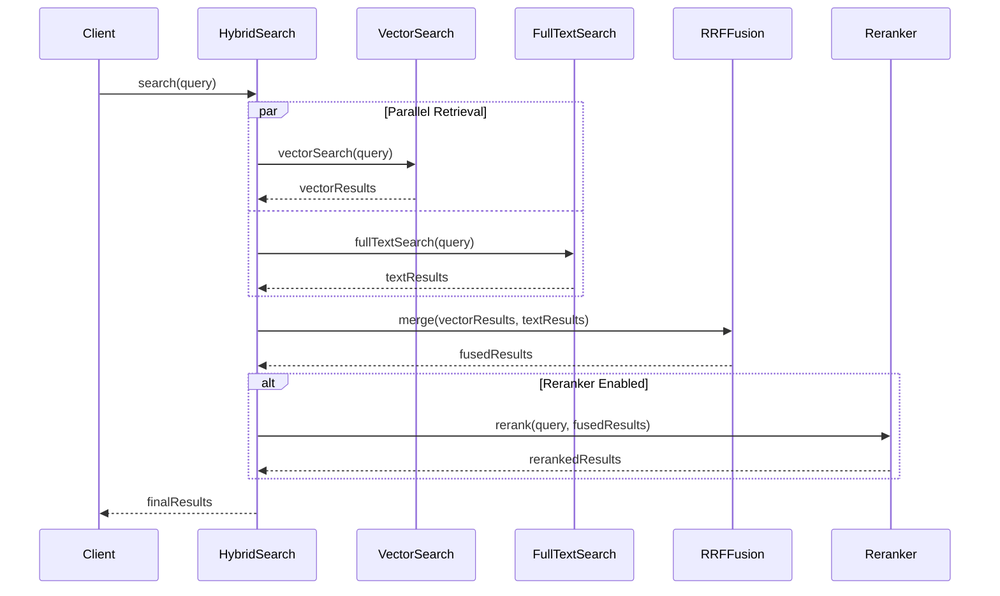
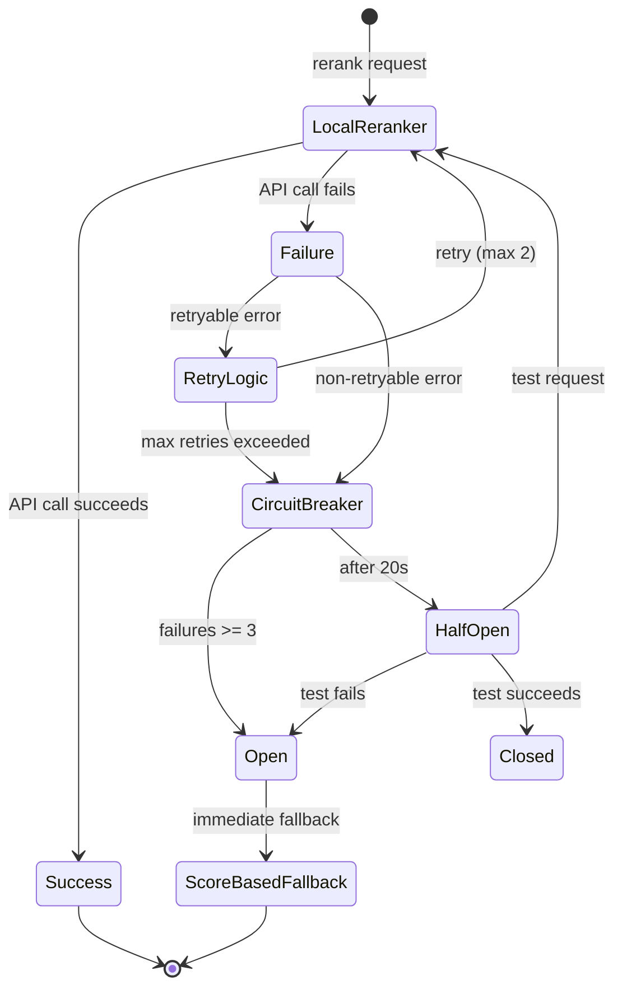

# Design Document: V2 RAG Migration

## Overview

本设计文档描述将 V1 RAG 核心算法迁移到 V2 的技术方案。迁移目标是保留 V1 的核心算法优势（RRF 混合检索、语义断崖检测、断路器模式、PostgreSQL 全文搜索、Reranker 重排序），同时整合为更清晰的服务结构，并与 V2 的 Spring AI 架构集成。

### 迁移原则

1. **保留 V1 算法**: 所有核心算法（RRF、语义断崖、断路器、Reranker）完整迁移，不做简化
2. **代码整理**: 合并冗余服务，统一接口风格，清理无用代码
3. **无需兼容**: V2 是全新实现，不需要兼容 V1 的旧代码或旧接口
4. **完整干净**: 删除所有不需要的代码，保证代码库整洁
5. **Spring AI 集成**: 使用 Spring AI 1.1.2 的 EmbeddingModel 接口

### 迁移范围

| V1 服务 | V2 目标服务 | 核心算法 | 迁移策略 |
|---------|-------------|----------|----------|
| HybridSearchService | HybridSearchService | RRF 融合算法 | 完整迁移，简化接口 |
| SemanticChunkingService | SemanticChunkingService | 语义断崖检测 | 完整迁移 |
| ResilientEmbeddingService | EmbeddingService | 断路器模式 | 合并到单一服务 |
| FullTextSearchServiceImpl | FullTextSearchService | PostgreSQL 全文搜索 | 完整迁移，移除旧接口 |
| ParentChildSearchService | ParentChildSearchService | 父子块检索策略 | 完整迁移 |
| LocalRerankerService | RerankerService | 本地重排序模型调用 | 合并三个服务为一个 |
| CachedRerankerService | (合并) | 重排序结果缓存 | 内置到 RerankerService |
| ResilientRerankerService | (合并) | 重排序断路器模式 | 内置到 RerankerService |

### V2 删除的 V1 代码

以下 V1 代码在 V2 中不需要，应删除或不迁移：

- `UnifiedEmbeddingService` - 合并到 `EmbeddingService`
- `UnifiedEmbeddingCacheService` - 合并到 `EmbeddingCacheService`
- `UnifiedChunkingService` - 合并到 `SemanticChunkingService`
- `UnifiedFullTextSearchService` - 合并到 `FullTextSearchService`
- `QueryExpansionService` - 如不需要查询扩展可删除
- `KeywordService` - 如不需要关键词提取可删除
- 所有 `*Impl` 后缀的实现类 - 直接使用服务类
- 所有旧的兼容方法（如 `hybridSearchWithFullText`）

## Architecture

### 服务层次结构

```
┌─────────────────────────────────────────────────────────────┐
│                      RAG Controller                          │
├─────────────────────────────────────────────────────────────┤
│                    HybridSearchService                       │
│  ┌─────────────────┐  ┌─────────────────┐  ┌──────────────┐ │
│  │ VectorSearch    │  │ FullTextSearch  │  │ RRF Fusion   │ │
│  └────────┬────────┘  └────────┬────────┘  └───────┬───────┘ │
├───────────┼────────────────────┼───────────────────┼─────────┤
│           │                    │                   │         │
│  ┌────────▼────────┐  ┌────────▼────────┐  ┌──────▼───────┐ │
│  │ EmbeddingService│  │FullTextSearch   │  │ Reranker     │ │
│  │ (Circuit Breaker)│  │Service          │  │ Service      │ │
│  └────────┬────────┘  └─────────────────┘  └──────────────┘ │
│           │                                                  │
│  ┌────────▼────────┐  ┌─────────────────┐  ┌──────────────┐ │
│  │ Spring AI       │  │ Semantic        │  │ Local BGE    │ │
│  │ EmbeddingModel  │  │ ChunkingService │  │ Reranker     │ │
│  └─────────────────┘  └─────────────────┘  └──────────────┘ │
├─────────────────────────────────────────────────────────────┤
│                    RagProperties (统一配置)                   │
└─────────────────────────────────────────────────────────────┘
```

### 数据流



### Reranker 降级流程



## Components and Interfaces

### 1. HybridSearchService

负责协调向量检索和全文检索，使用 RRF 算法融合结果。

```java
@Service
public class HybridSearchService {
    
    private static final double RRF_K = 60.0;
    
    /**
     * 执行混合检索
     * @param projectId 项目ID
     * @param query 查询文本
     * @param limit 结果数量限制
     * @return 融合后的搜索结果
     */
    public Mono<List<SearchResult>> search(UUID projectId, String query, int limit);
    
    /**
     * RRF 融合算法
     * Score = 1.0 / (k + rank)
     */
    List<SearchResult> applyReciprocalRankFusion(
        List<SearchResult> vectorResults,
        List<SearchResult> fullTextResults);
}
```

### 2. EmbeddingService (带断路器)

负责向量生成，集成断路器模式实现容错。

```java
@Service
public class EmbeddingService {
    
    // 断路器配置
    private static final int FAILURE_THRESHOLD = 5;
    private static final long RECOVERY_TIMEOUT_MS = 30000;
    
    /**
     * 生成文本向量（带断路器保护）
     */
    public Mono<float[]> generateEmbedding(String text);
    
    /**
     * 批量生成向量
     */
    public Mono<List<float[]>> generateEmbeddingsBatch(List<String> texts);
    
    /**
     * 向量相似度搜索
     */
    public Mono<List<SearchResult>> searchWithScore(UUID projectId, String query, int limit);
}
```

### 3. SemanticChunkingService

负责基于语义断崖检测的智能分块。

```java
@Service
public class SemanticChunkingService {
    
    /**
     * 将文本切分为语义子块
     * 使用相邻句子的 Embedding 相似度检测语义断崖
     */
    public Mono<List<ChildChunk>> splitIntoChildChunks(String content);
    
    /**
     * 检测语义断崖位置
     * 阈值：相似度低于第 20 百分位
     */
    List<Integer> detectSemanticCliffs(List<Double> similarities);
}
```

### 4. FullTextSearchService

负责 PostgreSQL 全文搜索。

```java
@Service
public class FullTextSearchService {
    
    /**
     * 执行全文搜索
     * 支持 plain, phrase, boolean, exact 四种查询类型
     */
    public Mono<List<SearchResult>> search(
        UUID projectId, 
        String query, 
        String sourceType, 
        int limit);
    
    /**
     * 自动检测查询类型
     */
    String detectQueryType(String query);
}
```

### 5. ParentChildSearchService

负责父子块检索策略。

```java
@Service
public class ParentChildSearchService {
    
    /**
     * 使用子块检索，返回父块内容
     * "小块检索，大块返回"策略
     */
    public Mono<List<SearchResult>> search(UUID projectId, String query, int limit);
    
    /**
     * 去重：同一父块只保留最高分的子块
     */
    List<SearchResult> deduplicateByParent(List<SearchResult> results);
}
```

### 6. RerankerService

负责搜索结果重排序，使用本地 bge-reranker-v2-m3 模型。

```java
@Service
public class RerankerService {
    
    // 断路器配置
    private static final int FAILURE_THRESHOLD = 3;
    private static final long RECOVERY_TIMEOUT_MS = 20000;
    
    /**
     * 重排序检索结果
     * @param query 查询文本
     * @param candidates 候选文本列表
     * @param topK 返回结果数量
     * @return 重排序后的结果（带得分）
     */
    public Mono<List<RerankResult>> rerank(String query, List<String> candidates, Integer topK);
    
    /**
     * 计算两个文本的相似度得分
     * 用于语义断崖检测
     */
    public Mono<Double> calculateSimilarity(String text1, String text2);
    
    /**
     * 批量计算相邻句子的相似度
     * @param sentences 句子列表
     * @return 相似度列表（长度 = sentences.size() - 1）
     */
    public Mono<List<Double>> calculateAdjacentSimilarities(List<String> sentences);
}

@Data
@AllArgsConstructor
public class RerankResult {
    private int index;      // 原始索引
    private double score;   // 重排序得分
    private String document; // 文档内容
}
```

### 7. RagProperties (统一配置)

```java
@ConfigurationProperties(prefix = "inkflow.rag")
public record RagProperties(
    // 混合检索配置
    HybridSearchConfig hybridSearch,
    // 向量服务配置
    EmbeddingConfig embedding,
    // 分块配置
    ChunkingConfig chunking,
    // 全文搜索配置
    FullTextConfig fullText
) {
    public record HybridSearchConfig(
        double rrfK,           // RRF 常数，默认 60
        double vectorWeight,   // 向量权重，默认 0.7
        double keywordWeight,  // 关键词权重，默认 0.3
        boolean enableReranker // 是否启用重排序
    ) {}
    
    public record EmbeddingConfig(
        int timeoutMs,         // 超时时间，默认 5000
        int maxRetries,        // 最大重试次数，默认 3
        int failureThreshold,  // 断路器阈值，默认 5
        long recoveryTimeoutMs // 恢复超时，默认 30000
    ) {}
    
    public record ChunkingConfig(
        int maxChildSize,      // 子块最大大小，默认 512
        int minChildSize,      // 子块最小大小，默认 100
        double cliffThreshold  // 断崖阈值百分位，默认 0.2
    ) {}
    
    public record FullTextConfig(
        String language,       // 语言配置，默认 chinese
        double titleWeight,    // 标题权重，默认 A
        double contentWeight   // 内容权重，默认 B
    ) {}
    
    public record RerankerConfig(
        boolean enabled,       // 是否启用重排序，默认 true
        String endpoint,       // 本地模型端点，默认 http://localhost:8000
        String apiPath,        // API 路径，默认 /v1/rerank
        int timeoutMs,         // 超时时间，默认 3000
        int maxRetries,        // 最大重试次数，默认 2
        int failureThreshold,  // 断路器阈值，默认 3
        long recoveryTimeoutMs,// 恢复超时，默认 20000
        boolean enableCache,   // 是否启用缓存，默认 true
        int cacheMaxSize,      // 缓存最大条目数，默认 1000
        long cacheExpirationMs // 缓存过期时间，默认 300000 (5分钟)
    ) {}
}
```

## Data Models

### SearchResult

```java
@Data
@Builder
public class SearchResult {
    private UUID id;
    private String sourceType;
    private UUID sourceId;
    private String content;
    private Map<String, Object> metadata;
    private Double similarity;      // 向量相似度
    private Double fullTextScore;   // 全文搜索分数
    private Double rrfScore;        // RRF 融合分数
}
```

### ChildChunk

```java
@Data
@Builder
public class ChildChunk {
    private String content;
    private int order;
    private int startPosition;
    private int endPosition;
    private UUID parentId;
}
```

### CircuitBreakerState

```java
public enum CircuitBreakerState {
    CLOSED,     // 正常状态
    OPEN,       // 熔断状态
    HALF_OPEN   // 半开状态（测试恢复）
}
```

### RerankResult

```java
@Data
@AllArgsConstructor
public class RerankResult {
    private int index;      // 原始索引位置
    private double score;   // 重排序得分 (0-1)
    private String document; // 文档内容
}
```

### RerankerCacheStatistics

```java
@Data
@Builder
public class RerankerCacheStatistics {
    private long cacheHits;      // 缓存命中次数
    private long cacheMisses;    // 缓存未命中次数
    private long totalRequests;  // 总请求次数
    private double hitRate;      // 命中率 (%)
    private int cacheSize;       // 当前缓存大小
    private int maxCacheSize;    // 最大缓存大小
}
```

## Correctness Properties

*A property is a characteristic or behavior that should hold true across all valid executions of a system-essentially, a formal statement about what the system should do. Properties serve as the bridge between human-readable specifications and machine-verifiable correctness guarantees.*

### Property 1: RRF Score Calculation Correctness

*For any* ranked list of search results from vector and full-text retrieval, the RRF score for each document SHALL be calculated as `1.0 / (60 + rank)` where rank starts from 1, and documents appearing in both lists SHALL have their scores accumulated.

**Validates: Requirements 1.2, 1.3**

### Property 2: RRF Result Ordering

*For any* list of search results after RRF fusion, each result's RRF score SHALL be greater than or equal to the next result's score (descending order).

**Validates: Requirements 1.4**

### Property 3: Graceful Degradation on Retrieval Failure

*For any* search operation where one retrieval path (vector or full-text) fails, the system SHALL return results from the successful path without throwing an exception.

**Validates: Requirements 1.5**

### Property 4: Sentence Splitting Preserves Quoted Content

*For any* text containing quoted strings (using Chinese or English quotation marks), splitting into sentences SHALL preserve the quoted content intact within a single sentence.

**Validates: Requirements 2.1**

### Property 5: Adjacent Similarity Count

*For any* list of n sentences (n >= 2), calculating adjacent similarities SHALL produce exactly n-1 similarity scores.

**Validates: Requirements 2.2**

### Property 6: Semantic Cliff Detection Threshold

*For any* list of similarity scores, positions marked as semantic cliffs SHALL have similarity values at or below the 20th percentile of all scores.

**Validates: Requirements 2.3**

### Property 7: Chunk Size Constraint

*For any* chunk produced by the semantic chunking service, its size SHALL not exceed the configured maximum chunk size.

**Validates: Requirements 2.5**

### Property 8: Circuit Breaker State Transitions

*For any* sequence of embedding service calls:
- After 5 consecutive failures, the circuit breaker state SHALL be OPEN
- While OPEN, new requests SHALL be rejected immediately
- After 30 seconds in OPEN state, the state SHALL transition to HALF_OPEN
- A successful request in HALF_OPEN state SHALL transition to CLOSED
- A failed request in HALF_OPEN state SHALL transition back to OPEN

**Validates: Requirements 3.1, 3.2, 3.3, 3.4, 3.5**

### Property 9: Full-Text Search Query Type Support

*For any* query string, the full-text search service SHALL correctly identify and execute one of the supported query types (plain, phrase, boolean, exact) based on query characteristics.

**Validates: Requirements 4.2**

### Property 10: Full-Text Search Error Handling

*For any* full-text search operation that encounters a database error, the system SHALL return an empty result list and log the error.

**Validates: Requirements 4.5**

### Property 11: Configuration Defaults

*For any* missing configuration value in RagProperties, the system SHALL use the documented default value.

**Validates: Requirements 5.3**

### Property 12: Parent-Child Search Deduplication

*For any* search result set where multiple child chunks match the same parent, the final results SHALL contain only one entry per parent, using the highest-scoring child's score.

**Validates: Requirements 6.3**

### Property 13: Context Building Sort Order

*For any* list of search results used for AI context building, the results SHALL be sorted by chapter order first, then by block order within each chapter.

**Validates: Requirements 6.5**

### Property 14: Embedding Provider Selection

*For any* embedding generation request:
- If a custom provider is configured, that provider SHALL be used
- If no custom provider is configured, the default embedding model SHALL be used

**Validates: Requirements 7.2, 7.3**

### Property 15: Embedding Failure Triggers Circuit Breaker

*For any* embedding generation failure, the circuit breaker failure counter SHALL be incremented.

**Validates: Requirements 7.4**

### Property 16: Reranker Score Ordering

*For any* list of reranked results, each result's score SHALL be greater than or equal to the next result's score (descending order).

**Validates: Requirements 1.2 (Reranker integration)**

### Property 17: Reranker Circuit Breaker State Transitions

*For any* sequence of reranker service calls:
- After 3 consecutive failures, the circuit breaker state SHALL be OPEN
- While OPEN, new requests SHALL fall back to score-based ranking immediately
- After 20 seconds in OPEN state, the state SHALL transition to HALF_OPEN
- A successful request in HALF_OPEN state SHALL transition to CLOSED

**Validates: Requirements 3.1-3.5 (Reranker variant)**

### Property 18: Reranker Cache Consistency

*For any* identical rerank request (same query and candidates), the cached result SHALL be returned if the cache entry has not expired.

**Validates: Requirements 5.3 (Reranker caching)**

### Property 19: Reranker Fallback Produces Valid Results

*For any* reranker failure with fallback enabled, the system SHALL return a valid list of RerankResult objects using score-based ranking.

**Validates: Requirements 1.5 (Reranker variant)**

### Property 20: Adjacent Similarity Count for Reranker

*For any* list of n sentences (n >= 2) passed to calculateAdjacentSimilarities, the result SHALL contain exactly n-1 similarity scores.

**Validates: Requirements 2.2 (Reranker-based similarity)**

## Error Handling

### 断路器错误处理

```java
public class CircuitBreakerOpenException extends RuntimeException {
    private final long remainingRecoveryTimeMs;
    
    public CircuitBreakerOpenException(long remainingRecoveryTimeMs) {
        super("Circuit breaker is open, retry after " + remainingRecoveryTimeMs + "ms");
        this.remainingRecoveryTimeMs = remainingRecoveryTimeMs;
    }
}
```

### 检索降级策略

1. **向量检索失败**: 返回全文检索结果
2. **全文检索失败**: 返回向量检索结果
3. **两者都失败**: 返回空列表并记录错误
4. **嵌入服务不可用**: 触发断路器，使用缓存或降级

### 错误日志规范

```java
// 错误级别
log.error("Embedding service unavailable: {}", e.getMessage());

// 警告级别（降级）
log.warn("Vector search failed, falling back to full-text only: {}", e.getMessage());

// 信息级别（断路器状态变化）
log.info("Circuit breaker state changed: {} -> {}", oldState, newState);
```

## Testing Strategy

### 双重测试方法

本迁移采用单元测试和属性测试相结合的方法：

- **单元测试**: 验证具体示例、边界条件和错误处理
- **属性测试**: 验证应在所有输入上成立的通用属性

### 属性测试框架

使用 **jqwik** 作为属性测试框架（与 V1 保持一致）。

```xml
<dependency>
    <groupId>net.jqwik</groupId>
    <artifactId>jqwik</artifactId>
    <version>1.9.0</version>
    <scope>test</scope>
</dependency>
```

### 属性测试配置

- 每个属性测试运行最少 **100 次迭代**
- 每个属性测试必须使用注释引用设计文档中的正确性属性
- 注释格式: `**Feature: v2-rag-migration, Property {number}: {property_text}**`

### 测试覆盖范围

| 组件 | 单元测试 | 属性测试 |
|------|----------|----------|
| HybridSearchService | RRF 计算示例 | Property 1, 2, 3 |
| SemanticChunkingService | 边界条件 | Property 4, 5, 6, 7 |
| EmbeddingService | 断路器状态 | Property 8, 14, 15 |
| FullTextSearchService | 查询类型示例 | Property 9, 10 |
| RagProperties | 默认值验证 | Property 11 |
| ParentChildSearchService | 去重示例 | Property 12, 13 |
| RerankerService | 重排序示例 | Property 16, 17, 18, 19, 20 |

### 测试数据生成器

```java
@Provide
Arbitrary<List<SearchResult>> searchResults() {
    return Arbitraries.integers().between(1, 20)
        .flatMap(size -> Arbitraries.of(SearchResult.class)
            .list().ofSize(size));
}

@Provide
Arbitrary<String> textWithQuotes() {
    return Arbitraries.strings()
        .withChars("abcdefghijklmnopqrstuvwxyz。，！？")
        .ofMinLength(10)
        .ofMaxLength(500)
        .map(s -> "他说："" + s + ""然后离开了。");
}
```
