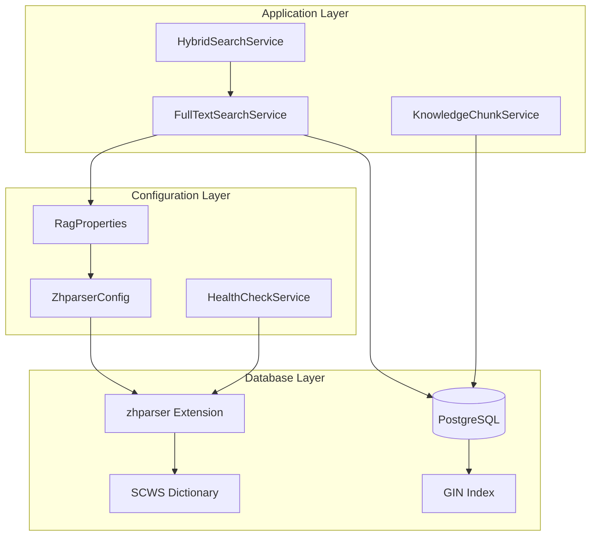
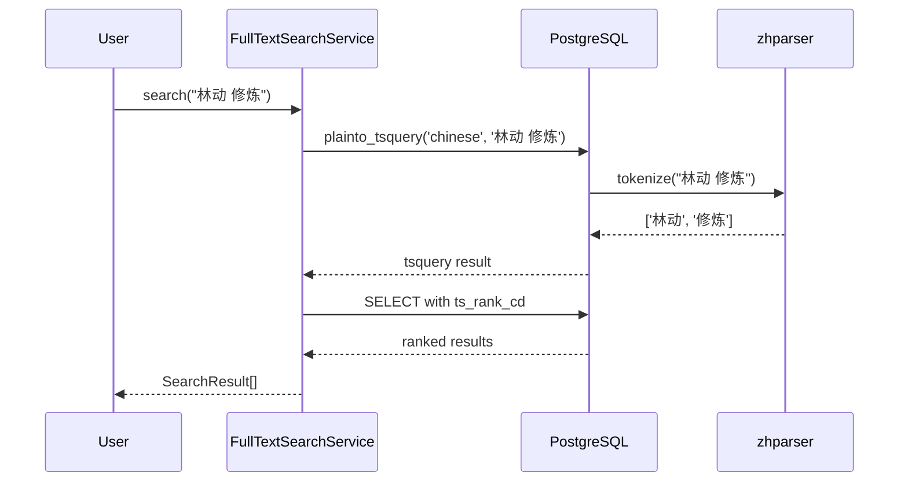

# Design Document: zhparser 中文全文搜索集成

## Overview

本设计文档描述如何将 zhparser 中文分词扩展集成到 InkFlow 2.0 的 RAG 系统中，以实现高质量的中文全文搜索。zhparser 基于 SCWS 分词库，能够提供专业级的中文分词能力，显著提升中文小说内容的搜索召回率和精确度。

### 核心目标

1. 替换当前的 `simple` 配置为 `chinese` 配置
2. 利用 zhparser 的中文分词能力提升搜索质量
3. 支持自定义词典加载（角色名、地名、武功招式等）
4. 保持向后兼容，支持优雅降级

## Architecture



### 数据流



## Components and Interfaces

### 1. ZhparserHealthChecker

启动时验证 zhparser 扩展可用性的健康检查组件。

```java
@Component
@Slf4j
public class ZhparserHealthChecker implements ApplicationRunner {
    
    private final JdbcTemplate jdbcTemplate;
    private final RagProperties ragProperties;
    
    private volatile boolean zhparserAvailable = false;
    
    @Override
    public void run(ApplicationArguments args) {
        checkZhparserAvailability();
    }
    
    public void checkZhparserAvailability() {
        try {
            // 检查扩展是否安装
            String sql = """
                SELECT EXISTS (
                    SELECT 1 FROM pg_extension WHERE extname = 'zhparser'
                )
                """;
            Boolean exists = jdbcTemplate.queryForObject(sql, Boolean.class);
            
            if (Boolean.TRUE.equals(exists)) {
                // 验证 chinese 配置是否可用
                jdbcTemplate.queryForObject(
                    "SELECT to_tsvector('chinese', '测试')", 
                    String.class
                );
                zhparserAvailable = true;
                log.info("zhparser extension is available and configured");
            } else {
                log.warn("zhparser extension is not installed, falling back to simple configuration");
            }
        } catch (Exception e) {
            log.warn("zhparser check failed: {}, falling back to simple configuration", e.getMessage());
            zhparserAvailable = false;
        }
    }
    
    public boolean isZhparserAvailable() {
        return zhparserAvailable;
    }
    
    public String getEffectiveLanguage() {
        if (zhparserAvailable && "chinese".equals(ragProperties.fullText().language())) {
            return "chinese";
        }
        return "simple";
    }
}
```

### 2. FullTextSearchService 增强

更新现有的 FullTextSearchService 以支持 zhparser。

```java
@Service
@RequiredArgsConstructor
public class FullTextSearchService {
    
    private final JdbcTemplate jdbcTemplate;
    private final RagProperties ragProperties;
    private final ZhparserHealthChecker healthChecker;
    
    // 支持的语言配置白名单（新增 chinese）
    private static final Set<String> SUPPORTED_LANGUAGES = Set.of(
        "simple", "english", "chinese"
    );
    
    /**
     * 获取有效的搜索语言配置
     * 如果配置为 chinese 但 zhparser 不可用，则降级到 simple
     */
    private String getEffectiveLanguage() {
        String configuredLang = ragProperties.fullText().language();
        
        if ("chinese".equalsIgnoreCase(configuredLang)) {
            if (healthChecker.isZhparserAvailable()) {
                return "chinese";
            }
            log.warn("Chinese language configured but zhparser unavailable, using simple");
            return "simple";
        }
        
        if (configuredLang != null && SUPPORTED_LANGUAGES.contains(configuredLang.toLowerCase())) {
            return configuredLang.toLowerCase();
        }
        return "simple";
    }
    
    // ... 其他方法保持不变，但使用 getEffectiveLanguage() 替代 getSearchLanguage()
}
```

### 3. 数据库迁移脚本

```sql
-- V2__zhparser_integration.sql

-- 1. 安装 zhparser 扩展
CREATE EXTENSION IF NOT EXISTS zhparser;

-- 2. 创建中文全文搜索配置
DROP TEXT SEARCH CONFIGURATION IF EXISTS chinese CASCADE;
CREATE TEXT SEARCH CONFIGURATION chinese (PARSER = zhparser);

-- 3. 添加词典映射
-- a: 形容词, b: 区别词, c: 连词, d: 副词, e: 叹词, f: 方位词
-- g: 语素, h: 前缀, i: 成语, j: 简称, k: 后缀, l: 习惯用语
-- m: 数词, n: 名词, o: 拟声词, p: 介词, q: 量词, r: 代词
-- s: 处所词, t: 时间词, u: 助词, v: 动词, w: 标点符号
-- x: 非语素字, y: 语气词, z: 状态词
ALTER TEXT SEARCH CONFIGURATION chinese ADD MAPPING FOR 
    a,b,c,d,e,f,g,h,i,j,k,l,m,n,o,p,q,r,s,t,u,v,w,x,y,z 
    WITH simple;

-- 4. 配置 zhparser 参数
-- zhparser.multi_short: 短词复合 (0:关闭, 1:开启)
-- zhparser.multi_duality: 散字二元复合 (0:关闭, 1:开启)
-- zhparser.multi_zmain: 重要单字复合 (0:关闭, 1:开启)
-- zhparser.multi_zall: 全部单字复合 (0:关闭, 1:开启)
ALTER ROLE current_user SET zhparser.multi_short = on;
ALTER ROLE current_user SET zhparser.multi_duality = off;
ALTER ROLE current_user SET zhparser.multi_zmain = off;
ALTER ROLE current_user SET zhparser.multi_zall = off;

-- 5. 配置标点过滤
-- zhparser.punctuation_ignore: 忽略标点符号
ALTER ROLE current_user SET zhparser.punctuation_ignore = on;

-- 6. 更新 knowledge_chunks 表的 text_search 列
-- 使用 chinese 配置替代 simple
ALTER TABLE knowledge_chunks 
    DROP COLUMN IF EXISTS text_search;

ALTER TABLE knowledge_chunks 
    ADD COLUMN text_search tsvector 
    GENERATED ALWAYS AS (to_tsvector('chinese', COALESCE(content, ''))) STORED;

-- 7. 重建 GIN 索引
DROP INDEX IF EXISTS idx_knowledge_chunks_text_search;
CREATE INDEX idx_knowledge_chunks_text_search ON knowledge_chunks USING GIN (text_search);

-- 8. 创建验证函数
CREATE OR REPLACE FUNCTION verify_zhparser_config()
RETURNS TABLE(config_name TEXT, config_value TEXT) AS $$
BEGIN
    RETURN QUERY
    SELECT 'zhparser.multi_short'::TEXT, current_setting('zhparser.multi_short', true)
    UNION ALL
    SELECT 'zhparser.punctuation_ignore'::TEXT, current_setting('zhparser.punctuation_ignore', true)
    UNION ALL
    SELECT 'chinese_config_exists'::TEXT, 
           CASE WHEN EXISTS (
               SELECT 1 FROM pg_ts_config WHERE cfgname = 'chinese'
           ) THEN 'true' ELSE 'false' END;
END;
$$ LANGUAGE plpgsql;

-- 9. 添加注释
COMMENT ON COLUMN knowledge_chunks.text_search IS 
    'Full-text search vector using zhparser chinese configuration for high-quality Chinese segmentation';
```

### 4. 自定义词典支持

```java
@Service
@RequiredArgsConstructor
@Slf4j
public class ZhparserDictionaryService {
    
    private final JdbcTemplate jdbcTemplate;
    
    /**
     * 加载自定义词典
     * 词典格式: 词语\t词频\t词性
     * 例如: 林动\t100\tn
     */
    public void loadCustomDictionary(List<DictionaryEntry> entries) {
        // zhparser 使用 SCWS 词典，需要通过文件系统加载
        // 这里提供 SQL 级别的词典扩展方案
        
        for (DictionaryEntry entry : entries) {
            try {
                // 使用 ts_lexize 验证词条
                String sql = "SELECT ts_lexize('chinese', ?)";
                jdbcTemplate.queryForList(sql, entry.word());
                log.debug("Dictionary entry validated: {}", entry.word());
            } catch (Exception e) {
                log.warn("Failed to validate dictionary entry: {}", entry.word(), e);
            }
        }
    }
    
    /**
     * 测试分词效果
     */
    public List<String> testSegmentation(String text) {
        String sql = """
            SELECT word FROM ts_debug('chinese', ?)
            WHERE alias IS NOT NULL
            """;
        return jdbcTemplate.queryForList(sql, String.class, text);
    }
    
    public record DictionaryEntry(String word, int frequency, String pos) {}
}
```

## Data Models

### 配置扩展

```java
// RagProperties.FullTextConfig 扩展
public record FullTextConfig(
    boolean enabled,
    String language,           // 新增 "chinese" 选项
    String titleWeight,
    String contentWeight,
    int timeoutMs,
    int maxRetries,
    int retryDelayMs,
    boolean fallbackToKeyword,
    HighlightConfig highlight,
    ZhparserConfig zhparser    // 新增 zhparser 配置
) {
    public static final String DEFAULT_LANGUAGE = "chinese"; // 默认改为 chinese
}

// 新增 zhparser 配置
public record ZhparserConfig(
    boolean multiShort,        // 短词复合
    boolean multiDuality,      // 散字二元复合
    boolean punctuationIgnore, // 忽略标点
    String customDictPath      // 自定义词典路径
) {
    public static ZhparserConfig defaults() {
        return new ZhparserConfig(true, false, true, null);
    }
}
```

### application.yml 配置示例

```yaml
inkflow:
  rag:
    full-text:
      enabled: true
      language: chinese          # 使用 zhparser
      title-weight: A
      content-weight: B
      timeout-ms: 5000
      zhparser:
        multi-short: true        # 启用短词复合，提高召回率
        multi-duality: false     # 关闭散字二元复合
        punctuation-ignore: true # 忽略标点符号
        custom-dict-path: null   # 自定义词典路径（可选）
```

## Correctness Properties

*A property is a characteristic or behavior that should hold true across all valid executions of a system-essentially, a formal statement about what the system should do. Properties serve as the bridge between human-readable specifications and machine-verifiable correctness guarantees.*

### Property 1: Chinese Configuration Consistency

*For any* text indexing or search operation when language is configured as "chinese" and zhparser is available, the system SHALL use the chinese text search configuration consistently for both tsvector generation and tsquery parsing.

**Validates: Requirements 1.2, 1.3, 3.1, 3.2, 5.1**

### Property 2: Graceful Degradation

*For any* search operation when zhparser is unavailable, the system SHALL fall back to simple configuration and return valid (possibly less accurate) results rather than failing.

**Validates: Requirements 1.4, 5.4**

### Property 3: Punctuation Filtering

*For any* Chinese text containing punctuation marks, the generated tsvector SHALL NOT contain punctuation tokens when punctuation_ignore is enabled.

**Validates: Requirements 2.2**

### Property 4: Custom Dictionary Recognition

*For any* term defined in the custom dictionary, the zhparser segmentation SHALL recognize it as a single token rather than splitting it into multiple tokens.

**Validates: Requirements 2.4**

### Property 5: Relevance Ranking Correctness

*For any* search query, results SHALL be ordered by descending relevance score, with title matches weighted higher (weight A) than content-only matches (weight B).

**Validates: Requirements 4.1, 4.3, 4.4**

### Property 6: Mixed-Language Query Handling

*For any* query containing both Chinese and English terms, the system SHALL correctly tokenize and match both language components.

**Validates: Requirements 4.2**

### Property 7: Search Round-Trip Consistency

*For any* Chinese text that is indexed, searching with a substring of that text SHALL return the original document in the results (assuming the substring forms valid tokens).

**Validates: Requirements 1.2, 3.2**

## Error Handling

### 错误场景与处理策略

| 错误场景 | 处理策略 | 日志级别 |
|---------|---------|---------|
| zhparser 扩展未安装 | 降级到 simple 配置 | WARN |
| chinese 配置不存在 | 降级到 simple 配置 | WARN |
| 分词超时 | 返回空结果，记录执行时间 | WARN |
| 无效查询语法 | 返回空结果 | DEBUG |
| 数据库连接错误 | 返回空结果，触发重试 | ERROR |

### 降级策略

```java
public String getEffectiveLanguage() {
    String configured = ragProperties.fullText().language();
    
    // 优先级: chinese > english > simple
    if ("chinese".equalsIgnoreCase(configured)) {
        if (healthChecker.isZhparserAvailable()) {
            return "chinese";
        }
        log.warn("Configured language 'chinese' unavailable, degrading to 'simple'");
    }
    
    if ("english".equalsIgnoreCase(configured)) {
        return "english";
    }
    
    return "simple";
}
```

## Testing Strategy

### 双重测试方法

本功能采用单元测试和属性测试相结合的方式：

- **单元测试**: 验证特定场景和边界条件
- **属性测试**: 验证跨所有输入的通用属性

### 属性测试框架

使用 **jqwik** 作为属性测试框架（已在项目中配置）。

### 测试配置

```java
@PropertyDefaults(tries = 100)
class ZhparserPropertyTest {
    // 属性测试将运行 100 次迭代
}
```

### 单元测试覆盖

1. zhparser 扩展可用性检查
2. 降级到 simple 配置
3. 各种查询类型（plain, phrase, boolean, exact）
4. 中英混合查询
5. 空查询和无效查询处理

### 属性测试覆盖

1. **Property 1**: 配置一致性 - 生成随机中文文本，验证索引和搜索使用相同配置
2. **Property 3**: 标点过滤 - 生成带标点的文本，验证 tsvector 不含标点
3. **Property 5**: 排名正确性 - 生成多个文档，验证结果按相关性排序
4. **Property 6**: 混合语言 - 生成中英混合查询，验证两种语言都能匹配
5. **Property 7**: 搜索往返 - 索引文本后搜索子串，验证能找到原文档

### 测试数据生成器

```java
@Provide
Arbitrary<String> chineseText() {
    return Arbitraries.strings()
        .withCharRange('\u4e00', '\u9fa5')  // CJK Unified Ideographs
        .ofMinLength(2)
        .ofMaxLength(100);
}

@Provide
Arbitrary<String> mixedLanguageText() {
    return Combinators.combine(
        chineseText(),
        Arbitraries.strings().alpha().ofMinLength(1).ofMaxLength(20)
    ).as((chinese, english) -> chinese + " " + english);
}
```
